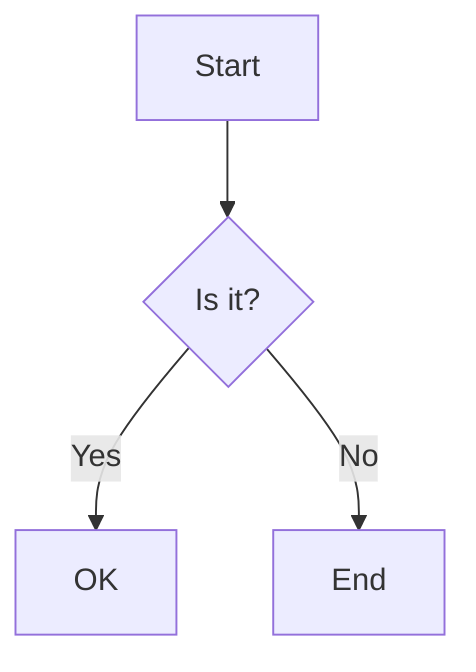

# Custom Processors Documentation

## Overview

Custom processors enable advanced content transformation during the build process. They work in a chain, processing content sequentially with configurable priorities.

## Quick Start

### Using Built-in Processors

1. Configure processors in `book-config.json`:
```json
{
  "processors": {
    "enabled": ["metadata", "include", "variable", "table"],
    "options": {
      "variable": {
        "variables": {
          "author": "Your Name",
          "year": 2024
        }
      }
    }
  }
}
```

2. Build with processors:
```bash
npm run build:processors
```

### Creating Custom Processors

1. Create a new processor:
```javascript
// processors/my-processor.js
const { BaseProcessor } = require('../scripts/processor-system');

class MyProcessor extends BaseProcessor {
  async process(content, metadata) {
    // Transform content
    return content.replace(/foo/g, 'bar');
  }
}

module.exports = MyProcessor;
```

2. Add to configuration:
```json
{
  "processors": {
    "custom": [
      {
        "path": "./processors/my-processor.js",
        "priority": 100
      }
    ]
  }
}
```

## Built-in Processors

### Metadata Processor
Extracts and processes front matter metadata.

**Priority:** 10 (runs first)

**Example:**
```markdown
---
title: My Chapter
author: John Doe
---

# {{var:title}}
By {{var:author}}
```

### Include Processor
Includes content from other files.

**Priority:** 20

**Syntax:** `{{include:path/to/file.md}}`

**Options:**
- `basePath`: Base directory for includes
- `recursive`: Allow nested includes
- `maxDepth`: Maximum include depth

**Example:**
```markdown
# Chapter 1

{{include:sections/introduction.md}}

{{include:examples/code-sample.md}}
```

### Variable Processor
Replaces variables with values.

**Priority:** 30

**Syntax:** `{{var:name}}`

**Options:**
- `variables`: Object of variable values
- `allowEnv`: Use environment variables
- `prefix`: Environment variable prefix

**Example:**
```markdown
Copyright {{var:year}} by {{var:author}}

Build date: {{var:date}}
```

### Code Block Processor
Enhanced code block processing with execution support.

**Priority:** 120

**Syntax:**
````markdown
```javascript:exec
console.log("Hello, World!");
return 2 + 2;
```
````

**Options:**
- `languages`: Enabled languages for execution
- `timeout`: Execution timeout
- `sandbox`: Use sandboxed execution

### Link Processor
Transforms links based on rules.

**Priority:** 200

**Options:**
- `baseUrl`: Base URL for relative links
- `external`: External link attributes
- `transforms`: URL transformation rules

**Example configuration:**
```json
{
  "link": {
    "baseUrl": "https://example.com/",
    "external": {
      "target": "_blank",
      "rel": "noopener noreferrer"
    }
  }
}
```

### Table Processor
Enhanced table processing with CSV support.

**Priority:** 110

**Syntax:**
````markdown
```csv
Name,Age,City
John Doe,30,New York
Jane Smith,25,London
```
````

**Options:**
- `csvDelimiter`: CSV delimiter character
- `headers`: First row as headers
- `alignment`: Table alignment

### Diagram Processor
Converts diagram code to images.

**Priority:** 100

**Supported types:**
- Mermaid
- PlantUML
- Graphviz

**Example:**
````markdown

````

## Custom Processor Development

### Processor Base Class

All processors must extend `BaseProcessor`:

```javascript
const { BaseProcessor } = require('../scripts/processor-system');

class CustomProcessor extends BaseProcessor {
  constructor(options = {}) {
    super({
      // Default options
      enabled: true,
      ...options
    });
  }

  async process(content, metadata) {
    // Process content
    return processedContent;
  }

  validate() {
    // Validate configuration
    return true;
  }
}
```

### Metadata Object

The metadata object contains:
- `filePath`: Absolute file path
- `relativePath`: Relative to source directory
- `filename`: File name
- `directory`: Directory path
- Additional properties from front matter

### Processing Order

Processors run in priority order:
1. **Metadata** (10) - Extract front matter
2. **Include** (20) - Include files
3. **Variable** (30) - Replace variables
4. **Diagram** (100) - Render diagrams
5. **Table** (110) - Process tables
6. **Code Block** (120) - Execute code
7. **Link** (200) - Transform links
8. **Custom** (as configured)

### Error Handling

```javascript
class SafeProcessor extends BaseProcessor {
  async process(content, metadata) {
    try {
      // Processing logic
      return processedContent;
    } catch (error) {
      // Log error
      console.error(`Error in ${this.name}:`, error);
      
      // Return original content
      return content;
    }
  }
}
```

## Advanced Examples

### Glossary Processor

Automatically links glossary terms:

```javascript
class GlossaryProcessor extends BaseProcessor {
  constructor(options = {}) {
    super({
      glossaryFile: 'glossary.json',
      tooltip: true,
      ...options
    });
  }

  async process(content, metadata) {
    const glossary = await this.loadGlossary();
    
    for (const [term, definition] of Object.entries(glossary)) {
      const regex = new RegExp(`\\b${term}\\b`, 'gi');
      content = content.replace(regex, 
        `<abbr title="${definition}">${term}</abbr>`
      );
    }
    
    return content;
  }
}
```

### Citation Processor

Formats citations and creates bibliography:

```javascript
class CitationProcessor extends BaseProcessor {
  constructor(options = {}) {
    super({
      style: 'apa',
      bibliographyFile: 'references.bib',
      ...options
    });
  }

  async process(content, metadata) {
    // Process citations [@author2023]
    const citations = [];
    
    content = content.replace(/\[@(\w+)\]/g, (match, key) => {
      citations.push(key);
      return `<cite data-key="${key}">[${citations.length}]</cite>`;
    });
    
    // Add bibliography if citations exist
    if (citations.length > 0) {
      const bibliography = await this.generateBibliography(citations);
      content += '\n\n## References\n\n' + bibliography;
    }
    
    return content;
  }
}
```

### API Data Processor

Fetches and embeds data from APIs:

```javascript
class APIProcessor extends BaseProcessor {
  async process(content, metadata) {
    const regex = /{{api:(.+?)}}/g;
    const matches = Array.from(content.matchAll(regex));
    
    for (const [fullMatch, endpoint] of matches) {
      try {
        const response = await fetch(endpoint);
        const data = await response.json();
        content = content.replace(fullMatch, 
          JSON.stringify(data, null, 2)
        );
      } catch (error) {
        content = content.replace(fullMatch, 
          `[API Error: ${error.message}]`
        );
      }
    }
    
    return content;
  }
}
```

## Configuration Reference

### Complete Configuration Example

```json
{
  "processors": {
    "enabled": [
      "metadata",
      "include", 
      "variable",
      "diagram",
      "table",
      "codeBlock",
      "link"
    ],
    "custom": [
      {
        "path": "./processors/glossary-processor.js",
        "priority": 50,
        "options": {
          "glossaryFile": "./src/glossary.json"
        }
      },
      {
        "path": "./processors/emoji-processor.js",
        "priority": 150
      }
    ],
    "options": {
      "include": {
        "basePath": "./src",
        "recursive": true,
        "maxDepth": 3
      },
      "variable": {
        "variables": {
          "version": "1.0.0",
          "author": "Your Name",
          "year": 2024
        }
      },
      "codeBlock": {
        "languages": {
          "javascript": true,
          "python": false
        },
        "timeout": 5000
      },
      "link": {
        "external": {
          "target": "_blank"
        }
      }
    }
  }
}
```

## Performance Optimization

### Caching

```javascript
class CachedProcessor extends BaseProcessor {
  constructor(options = {}) {
    super(options);
    this.cache = new Map();
  }

  async process(content, metadata) {
    const cacheKey = this.generateCacheKey(content);
    
    if (this.cache.has(cacheKey)) {
      return this.cache.get(cacheKey);
    }
    
    const result = await this.expensiveOperation(content);
    this.cache.set(cacheKey, result);
    
    return result;
  }
}
```

### Async Processing

```javascript
class AsyncProcessor extends BaseProcessor {
  async process(content, metadata) {
    // Process in parallel
    const tasks = this.extractTasks(content);
    const results = await Promise.all(
      tasks.map(task => this.processTask(task))
    );
    
    // Combine results
    return this.combineResults(content, results);
  }
}
```

## Testing Processors

### Unit Testing

```javascript
const { MyProcessor } = require('./my-processor');

describe('MyProcessor', () => {
  let processor;

  beforeEach(() => {
    processor = new MyProcessor({ option: 'value' });
  });

  test('processes content correctly', async () => {
    const input = 'Hello {{name}}!';
    const metadata = { name: 'World' };
    
    const result = await processor.process(input, metadata);
    
    expect(result).toBe('Hello World!');
  });
});
```

### Integration Testing

```bash
# Test specific processor
node -e "
const { ProcessorChain, MyProcessor } = require('./processor-system');
const chain = new ProcessorChain();
chain.addProcessor(new MyProcessor());

chain.process('test content').then(result => {
  console.log(result);
});
"
```

## Troubleshooting

### Processor Not Running

1. Check if processor is enabled in configuration
2. Verify processor path is correct
3. Check priority - may be overridden by other processors
4. Enable debug logging

### Content Not Transformed

1. Verify regex patterns match correctly
2. Check if content is already processed by earlier processor
3. Ensure processor returns modified content
4. Check for errors in processing logic

### Performance Issues

1. Profile processor execution time
2. Implement caching for expensive operations
3. Use streaming for large files
4. Process in parallel when possible

## Best Practices

1. **Single Responsibility**: Each processor should do one thing well
2. **Error Recovery**: Always handle errors gracefully
3. **Performance**: Cache expensive operations
4. **Testing**: Write unit tests for processors
5. **Documentation**: Document processor syntax and options
6. **Priority**: Set appropriate priorities for execution order