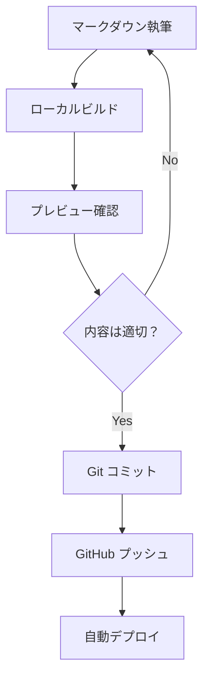
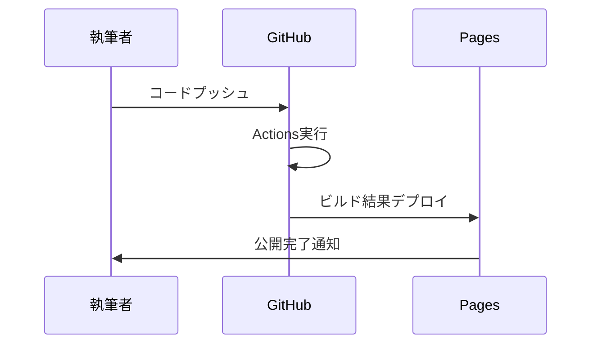

# 執筆ガイド

このガイドでは、Book Publishing Template を使って効果的な技術書を執筆するための方法を説明します。

## 📝 Markdown 記法の基本

### 見出し構造

```markdown
# 第1章: 章タイトル（レベル1）

## 1.1 セクションタイトル（レベル2）

### サブセクション（レベル3）

#### 詳細項目（レベル4）
```

**重要な原則:**
- 章のタイトルは `#` を使用
- セクションは `##` を使用
- 階層は最大4レベルまで推奨
- 見出しは目次に自動反映される

### テキスト装飾

```markdown
**太字テキスト**
*斜体テキスト*
~~取り消し線~~
`インラインコード`

> 引用文
> 複数行の引用も可能

---
水平線（セクション区切り）
```

### リスト

```markdown
<!-- 順序なしリスト -->
- 項目1
- 項目2
  - ネストした項目
  - もう一つのネスト項目
- 項目3

<!-- 順序ありリスト -->
1. 第一段階
2. 第二段階
   1. サブステップ
   2. もう一つのサブステップ
3. 第三段階

<!-- タスクリスト -->
- [x] 完了したタスク
- [ ] 未完了のタスク
- [ ] もう一つの未完了タスク
```

## 💻 コードの書き方

### インラインコード

```markdown
JavaScriptの `console.log()` 関数を使用します。
```

### コードブロック

```markdown
```javascript
function greetUser(name) {
    console.log(`Hello, ${name}!`);
    return `Welcome to the book, ${name}`;
}

// 使用例
const greeting = greetUser("読者");
```

```python
def calculate_fibonacci(n):
    """フィボナッチ数列のn番目を計算"""
    if n <= 1:
        return n
    return calculate_fibonacci(n-1) + calculate_fibonacci(n-2)

# 使用例
for i in range(10):
    print(f"F({i}) = {calculate_fibonacci(i)}")
```

```bash
# コマンドライン例
npm install
npm run build
npm run preview
```
```

### コードの品質を高めるコツ

1. **言語指定**: シンタックスハイライトのため必須
2. **コメント**: 重要な部分には日本語コメント
3. **実行可能**: 読者が実際に試せるコード
4. **段階的**: 複雑なコードは段階的に説明

## 📊 表とデータ

### 基本的な表

```markdown
| 項目 | 値 | 説明 |
|------|-----|------|
| Node.js | 16+ | JavaScript実行環境 |
| npm | 8+ | パッケージマネージャー |
| Git | 2.30+ | バージョン管理システム |
```

### 複雑な表

```markdown
| フォーマット | 特徴 | 用途 | サイズ |
|-------------|------|------|-------|
| Web (HTML) | インタラクティブ<br>検索可能<br>レスポンシブ | オンライン公開<br>学習プラットフォーム | 中 |
| PDF | 印刷最適化<br>固定レイアウト<br>注釈対応 | 配布資料<br>アーカイブ | 大 |
| EPUB | リフロー対応<br>フォント調整<br>軽量 | 電子書籍<br>モバイル閲覧 | 小 |
```

## 🖼️ 画像と図表

### 画像の挿入

```markdown
<!-- 基本的な画像 -->


<!-- 説明付き画像 -->

*図1: GitHub Pagesの設定画面で「Deploy from a branch」を選択*

<!-- リンク付き画像 -->
[](https://example.com)
```

### 図表の作成（Mermaid）

```markdown



```

## 🔗 リンクと参照

### 内部リンク

```markdown
<!-- 章間リンク -->
詳細は[第2章](../chapter02/index.md)を参照してください。

<!-- セクション内リンク -->
[設定方法](#設定方法)に戻る。

<!-- 付録へのリンク -->
完全なAPIリファレンスは[付録A](../../appendices/appendix01/index.md)を確認してください。
```

### 外部リンク

```markdown
<!-- 基本的な外部リンク -->
[公式ドキュメント](https://docs.example.com)

<!-- 説明付きリンク -->
詳細については[Pandoc公式サイト](https://pandoc.org/MANUAL.html "Pandoc User's Guide")を参照してください。

<!-- 脚注スタイル -->
詳細は公式ドキュメント[^1]を参照してください。

[^1]: https://docs.example.com/official-guide
```

## 📋 高度な記法

### 警告ボックス

```markdown
> **⚠️ 注意**
> この操作は元に戻せません。実行前にバックアップを作成してください。

> **💡 ヒント**
> 開発時は `npm run preview` でリアルタイムプレビューを活用しましょう。

> **🔥 重要**
> 本番環境では必ずHTTPSを使用してください。
```

### 詳細表示（Collapsible）

```markdown
<details>
<summary>詳細なコード例を表示</summary>

```javascript
// 複雑な実装例
class BookBuilder {
    constructor(config) {
        this.config = config;
        this.chapters = [];
    }
    
    addChapter(chapter) {
        this.chapters.push(chapter);
        return this;
    }
    
    build() {
        return {
            title: this.config.title,
            chapters: this.chapters,
            toc: this.generateTOC()
        };
    }
    
    generateTOC() {
        return this.chapters.map(ch => ({
            title: ch.title,
            level: ch.level,
            anchor: this.createAnchor(ch.title)
        }));
    }
}
```

</details>
```

### 定義リスト

```markdown
Static Site Generator (SSG)
: 事前にHTMLファイルを生成するWebサイト構築手法

Continuous Integration (CI)
: コードの変更を継続的に統合・テストする開発手法

Responsive Design
: 異なる画面サイズに適応するWebデザイン手法
```

## 📖 章構成のベストプラクティス

### 章の構造テンプレート

```markdown
# 第X章: 章タイトル

<!-- 章の概要 -->
この章では、[主要トピック]について学習します。

## 学習目標

この章を完了すると、以下ができるようになります：

- [ ] 目標1の説明
- [ ] 目標2の説明
- [ ] 目標3の説明

## X.1 導入セクション

### 背景と概要
[トピックの背景説明]

### 前提知識
この章を理解するために必要な知識：
- 前提知識1
- 前提知識2

## X.2 メインコンテンツ

### 基本概念
[基本的な概念の説明]

### 実践例
[具体的な例やコード]

### 応用例
[より高度な使用例]

## X.3 演習

### 練習問題
[読者が取り組める課題]

### 解答例
<details>
<summary>解答を表示</summary>
[解答とその説明]
</details>

## まとめ

この章では以下について学習しました：

- **重要ポイント1**: 簡潔な説明
- **重要ポイント2**: 簡潔な説明
- **重要ポイント3**: 簡潔な説明

次の章では、[次の章の内容]について学習します。

---

**📚 参考資料**
- [参考リンク1](URL)
- [参考リンク2](URL)
```

### セクション間の接続

```markdown
<!-- 前の章からの継続 -->
前章では[前の内容]について学習しました。この章では、それを基に[現在の内容]を説明します。

<!-- 次の章への橋渡し -->
次の章では、ここで学んだ[現在の内容]を活用して[次の内容]を実装していきます。
```

## 🎯 読者への配慮

### 対象読者の明確化

```markdown
## 対象読者

この書籍は以下の方を対象としています：

**主要対象:**
- プログラミング経験1年以上の開発者
- Web技術の基礎知識を持つ方
- GitHubを使用したことがある方

**前提知識:**
- HTML/CSSの基本理解
- コマンドラインの基本操作
- Gitの基本的な使い方

**推奨環境:**
- macOS、Windows、またはLinux
- Node.js 16以上
- モダンなWebブラウザ
```

### 段階的な説明

```markdown
<!-- ステップバイステップ -->
## 実装手順

### ステップ1: 環境準備
まず、必要なツールをインストールします。

### ステップ2: プロジェクト作成
新しいプロジェクトを作成します。

### ステップ3: 設定ファイルの編集
設定ファイルを適切に設定します。

### ステップ4: 動作確認
すべてが正しく動作することを確認します。
```

### エラー対処の記載

```markdown
## よくあるエラーと対処法

### エラー: "Command not found"

**症状:**
```bash
npm: command not found
```

**原因:** Node.jsがインストールされていない

**解決方法:**
1. [Node.js公式サイト](https://nodejs.org/)からダウンロード
2. インストーラーを実行
3. ターミナルを再起動
4. `node --version` で確認
```

## 📏 スタイルガイド

### 文体と表現

**統一する要素:**
- 敬語レベル（です・ます調）
- 技術用語の表記（カタカナ/英語）
- 数字の表記（全角/半角）
- 句読点の使い方

**避けるべき表現:**
- 曖昧な表現（「たぶん」「おそらく」）
- 感情的な表現（「最高！」「すごい」）
- 業界用語の多用
- 長すぎる文章（1文は80文字以内が目安）

### コードの命名規則

```markdown
<!-- 良い例 -->
function calculateTotalPrice(items) { ... }
const userAuthToken = "abc123";

<!-- 避けるべき例 -->
function calc(x) { ... }
const token = "abc123";
```

### 用語の統一

```markdown
<!-- 表記統一例 -->
- JavaScript（JavaScriptと統一、JSは避ける）
- Webサイト（ウェブサイトではなく）
- エラー（エラーと統一）
- コマンドライン（command lineやCLIではなく）
```

## 🔄 レビューとメンテナンス

### セルフレビューチェックリスト

- [ ] 誤字・脱字はないか
- [ ] コードは実際に動作するか
- [ ] リンクは正しく機能するか
- [ ] 画像は適切に表示されるか
- [ ] 章の流れは論理的か
- [ ] 対象読者に適した難易度か

### 継続的な改善

```markdown
<!-- TODO コメントの活用 -->
<!-- TODO: より詳細な例を追加 -->
<!-- FIXME: この説明は分かりにくい -->
<!-- NOTE: 最新バージョンで確認が必要 -->
```

### バージョン管理

```markdown
<!-- ファイルの先頭に履歴を記載 -->
<!--
履歴:
- 2024-06-16: 初版作成
- 2024-06-20: セクション2.3を詳細化
- 2024-06-25: 図表を追加
-->
```

---

このガイドを参考に、読者にとって価値のある、理解しやすい技術書を作成してください。

**💡 次のステップ:**
- [設定リファレンス](configuration.md) - 詳細なカスタマイズ方法
- [スタイルガイド](style-guide.md) - 一貫した表記の実現
- [ベストプラクティス](best-practices.md) - 効率的な執筆手法