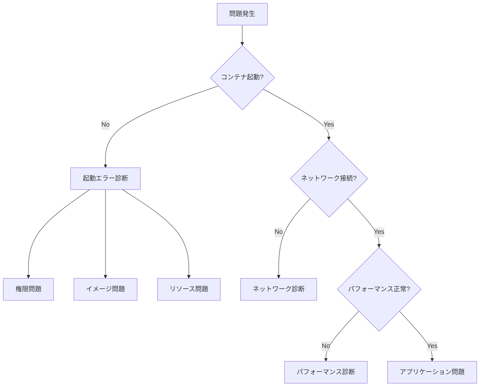

# Podman実践的トラブルシューティングガイド

本ガイドは、Podman運用で実際に遭遇する問題とその解決方法を、具体的な手順とともに解説します。

## 🔍 トラブルシューティングの基本アプローチ

### 診断フローチャート



### 基本診断コマンド

```bash
#!/bin/bash
# podman-diagnose.sh - Podman環境の基本診断

echo "=== Podman環境診断 ==="
echo ""

# 1. バージョン情報
echo "📌 バージョン情報:"
podman version

# 2. システム情報
echo -e "\n📌 システム情報:"
podman info --format json | jq '{
  host: {
    os: .host.os,
    kernel: .host.kernel,
    arch: .host.arch,
    rootless: .host.rootless,
    cgroupVersion: .host.cgroupVersion
  },
  store: {
    driver: .store.graphDriverName,
    root: .store.graphRoot,
    runRoot: .store.runRoot
  }
}'

# 3. 実行中のコンテナ
echo -e "\n📌 実行中のコンテナ:"
podman ps --format "table \{\{.Names\}\}\t\{\{.Status\}\}\t\{\{.State\}\}"

# 4. システムリソース
echo -e "\n📌 システムリソース:"
podman system df

# 5. ネットワーク
echo -e "\n📌 ネットワーク:"
podman network ls

# 6. 最近のイベント
echo -e "\n📌 最近のイベント (エラーのみ):"
podman events --since 1h --filter event=died --format json | jq '.'
```

## 🚫 起動エラーの解決

### 1. Permission Denied エラー

#### 症状
```bash
$ podman run alpine ls
Error: OCI runtime error: permission denied
```

#### 診断と解決
```bash
#!/bin/bash
# fix-permission-denied.sh

echo "権限問題の診断開始..."

# 1. SELinuxステータス確認
if command -v getenforce &> /dev/null; then
    selinux_status=$(getenforce)
    echo "SELinux: $selinux_status"
    
    if [ "$selinux_status" = "Enforcing" ]; then
        echo "⚠️  SELinuxが原因の可能性があります"
        
        # SELinuxコンテキストの修正
        echo "SELinuxコンテキストを修正中..."
        restorecon -R ~/.local/share/containers
        
        # 一時的な回避策（テスト用）
        echo "テスト実行（SELinux無効）:"
        podman run --security-opt label=disable alpine ls
    fi
fi

# 2. ユーザー名前空間確認
echo -e "\nユーザー名前空間の確認:"
if [ -f /proc/sys/kernel/unprivileged_userns_clone ]; then
    userns_enabled=$(cat /proc/sys/kernel/unprivileged_userns_clone)
    if [ "$userns_enabled" = "0" ]; then
        echo "❌ ユーザー名前空間が無効です"
        echo "修正方法:"
        echo "sudo sysctl -w kernel.unprivileged_userns_clone=1"
        echo "永続化: echo 'kernel.unprivileged_userns_clone=1' | sudo tee /etc/sysctl.d/userns.conf"
    else
        echo "✅ ユーザー名前空間は有効です"
    fi
fi

# 3. subuid/subgid確認
echo -e "\nUID/GIDマッピング:"
if ! grep -q "^$USER:" /etc/subuid; then
    echo "❌ subuidエントリがありません"
    echo "修正方法:"
    echo "sudo usermod --add-subuids 100000-165535 $USER"
else
    echo "✅ subuid: $(grep "^$USER:" /etc/subuid)"
fi

if ! grep -q "^$USER:" /etc/subgid; then
    echo "❌ subgidエントリがありません"
    echo "修正方法:"
    echo "sudo usermod --add-subgids 100000-165535 $USER"
else
    echo "✅ subgid: $(grep "^$USER:" /etc/subgid)"
fi

# 4. ストレージ権限
echo -e "\nストレージディレクトリ権限:"
storage_dirs=(
    "$HOME/.local/share/containers"
    "$HOME/.config/containers"
    "$XDG_RUNTIME_DIR/containers"
)

for dir in "${storage_dirs[@]}"; do
    if [ -d "$dir" ]; then
        perms=$(stat -c "%a %U:%G" "$dir")
        echo "$dir: $perms"
    else
        echo "$dir: 存在しません（作成されます）"
    fi
done
```

### 2. イメージプルエラー

#### 症状
```bash
$ podman pull myregistry.com/myimage:latest
Error: initializing source docker://myregistry.com/myimage:latest: pinging container registry myregistry.com: Get "https://myregistry.com/v2/": x509: certificate signed by unknown authority
```

#### 診断と解決
```bash
#!/bin/bash
# fix-registry-errors.sh

registry_url=$1
if [ -z "$registry_url" ]; then
    echo "使用方法: $0 <registry_url>"
    exit 1
fi

echo "レジストリ接続問題の診断: $registry_url"

# 1. DNS解決確認
echo -e "\n1. DNS解決テスト:"
if host $registry_url > /dev/null 2>&1; then
    echo "✅ DNS解決成功"
    host $registry_url | head -3
else
    echo "❌ DNS解決失敗"
    echo "対処法: /etc/resolv.confを確認してください"
fi

# 2. ネットワーク接続性
echo -e "\n2. ネットワーク接続性:"
if curl -k -s -o /dev/null -w "%{http_code}" https://$registry_url/v2/ | grep -q "401\|200"; then
    echo "✅ レジストリに到達可能"
else
    echo "❌ レジストリに到達不可"
    echo "ファイアウォールやプロキシ設定を確認してください"
fi

# 3. TLS証明書確認
echo -e "\n3. TLS証明書の確認:"
echo | openssl s_client -servername $registry_url -connect $registry_url:443 2>/dev/null | \
    openssl x509 -noout -text | grep -E "Subject:|Issuer:|Not After"

# 4. 自己署名証明書の場合の対処
echo -e "\n4. 自己署名証明書の設定方法:"
cat << EOF
# 方法1: 証明書を信頼済みに追加
sudo mkdir -p /etc/containers/certs.d/$registry_url
sudo cp registry-ca.crt /etc/containers/certs.d/$registry_url/ca.crt

# 方法2: insecureレジストリとして設定
echo '[[registry]]
location = "$registry_url"
insecure = true' | sudo tee -a /etc/containers/registries.conf

# 方法3: 一時的にスキップ
podman pull --tls-verify=false $registry_url/image:tag
EOF

# 5. 認証設定
echo -e "\n5. レジストリ認証:"
if podman login --get-login $registry_url > /dev/null 2>&1; then
    echo "✅ 認証情報が保存されています"
else
    echo "⚠️  認証が必要な場合:"
    echo "podman login $registry_url"
fi
```

### 3. ストレージ容量不足

#### 症状
```bash
$ podman pull large-image:latest
Error: writing blob: write /var/tmp/storage123/layer.tar: no space left on device
```

#### 診断と解決
```bash
#!/bin/bash
# fix-storage-issues.sh

echo "ストレージ問題の診断..."

# 1. ディスク使用状況
echo "📊 ディスク使用状況:"
df -h | grep -E "Filesystem|podman|containers|overlay|/var|/home|/$"

# 2. Podmanストレージ使用状況
echo -e "\n📊 Podmanストレージ分析:"
podman system df -v

# 3. 大きなイメージ/コンテナの特定
echo -e "\n📊 大きなイメージ (上位10):"
podman images --format "table \{\{.Repository\}\}:\{\{.Tag\}\}\t\{\{.Size\}\}" | sort -k2 -hr | head -10

echo -e "\n📊 大きなコンテナ (上位10):"
podman ps -a --format "table \{\{.Names\}\}\t\{\{.Size\}\}" | sort -k2 -hr | head -10

# 4. クリーンアップ提案
echo -e "\n🧹 クリーンアップオプション:"

# 未使用イメージ
unused_images=$(podman images -f dangling=true -q | wc -l)
if [ $unused_images -gt 0 ]; then
    echo "- 未使用イメージ: $unused_images 個"
    echo "  削除: podman image prune"
fi

# 停止中のコンテナ
stopped_containers=$(podman ps -a -f status=exited -q | wc -l)
if [ $stopped_containers -gt 0 ]; then
    echo "- 停止中のコンテナ: $stopped_containers 個"
    echo "  削除: podman container prune"
fi

# 未使用ボリューム
unused_volumes=$(podman volume ls -f dangling=true -q | wc -l)
if [ $unused_volumes -gt 0 ]; then
    echo "- 未使用ボリューム: $unused_volumes 個"
    echo "  削除: podman volume prune"
fi

# 5. 自動クリーンアップスクリプト
echo -e "\n🤖 自動クリーンアップスクリプト:"
cat << 'EOF'
#!/bin/bash
# auto-cleanup.sh - 定期実行用

# 30日以上古いイメージを削除
podman image prune -a --filter "until=720h" -f

# 終了したコンテナを削除
podman container prune -f

# 未使用ボリュームを削除
podman volume prune -f

# ビルドキャッシュをクリア
podman system prune --volumes -f
EOF
```

## 🌐 ネットワーク問題の解決

### 1. コンテナ間通信不可

#### 症状
```bash
# Container A から Container B に接続できない
$ podman exec container-a ping container-b
ping: container-b: Name or service not known
```

#### 診断と解決
```bash
#!/bin/bash
# fix-network-connectivity.sh

echo "コンテナネットワーク診断..."

# 1. ネットワーク構成の確認
echo "📡 ネットワーク一覧:"
podman network ls

echo -e "\n📡 デフォルトネットワークの詳細:"
podman network inspect podman | jq '.[0] | {
    name: .name,
    driver: .driver,
    subnet: .subnets[0].subnet,
    gateway: .subnets[0].gateway
}'

# 2. コンテナのネットワーク設定確認
container_name=${1:-"container-a"}
echo -e "\n📡 コンテナ '$container_name' のネットワーク設定:"
podman inspect $container_name | jq '.[0].NetworkSettings | {
    Networks: .Networks,
    IPAddress: .IPAddress,
    Gateway: .Gateway
}'

# 3. 同一ネットワーク上での通信設定
echo -e "\n💡 解決方法:"
cat << 'EOF'
# 方法1: 同じカスタムネットワークを使用
podman network create myapp-net
podman run -d --name app1 --network myapp-net alpine sleep 3600
podman run -d --name app2 --network myapp-net alpine sleep 3600

# 方法2: 既存コンテナをネットワークに接続
podman network connect myapp-net existing-container

# 方法3: Pod内で実行（localhost通信可能）
podman pod create --name myapp-pod
podman run -d --pod myapp-pod --name web nginx
podman run -d --pod myapp-pod --name app python:alpine
EOF

# 4. ネットワークデバッグツール
echo -e "\n🔧 デバッグコマンド:"
cat << 'EOF'
# DNS解決テスト
podman exec container-a nslookup container-b

# ネットワーク経路確認
podman exec container-a traceroute container-b

# ポート開放確認
podman exec container-a nc -zv container-b 80
EOF
```

### 2. ホストからコンテナへのアクセス不可

#### 症状
```bash
$ curl http://localhost:8080
curl: (7) Failed to connect to localhost port 8080: Connection refused
```

#### 診断と解決
```bash
#!/bin/bash
# fix-port-mapping.sh

port=${1:-8080}
echo "ポートマッピング診断 (ポート: $port)"

# 1. ポートマッピング確認
echo -e "\n🔌 ポートマッピング状態:"
podman port --all | grep -E ":$port|Port"

# 2. リッスンポート確認
echo -e "\n🔌 システムのリッスンポート:"
ss -tlnp | grep ":$port" || echo "ポート $port でリッスンしているプロセスなし"

# 3. ファイアウォール確認
echo -e "\n🔥 ファイアウォール状態:"
if command -v firewall-cmd &> /dev/null; then
    sudo firewall-cmd --list-ports
    
    # ポート開放が必要な場合
    echo -e "\nポート開放コマンド:"
    echo "sudo firewall-cmd --add-port=$port/tcp --permanent"
    echo "sudo firewall-cmd --reload"
fi

# 4. iptables確認（rootlessの場合）
echo -e "\n🔗 iptablesルール (rootless):"
if [ -f /proc/sys/net/ipv4/ip_forward ]; then
    ip_forward=$(cat /proc/sys/net/ipv4/ip_forward)
    echo "IP転送: $ip_forward"
    if [ "$ip_forward" = "0" ]; then
        echo "⚠️  IP転送が無効です"
        echo "有効化: echo 1 | sudo tee /proc/sys/net/ipv4/ip_forward"
    fi
fi

# 5. 正しいポートマッピング例
echo -e "\n✅ 正しいポートマッピング方法:"
cat << EOF
# 基本的なマッピング
podman run -d -p 8080:80 nginx

# 特定インターフェースにバインド
podman run -d -p 127.0.0.1:8080:80 nginx

# 全インターフェースにバインド
podman run -d -p 0.0.0.0:8080:80 nginx

# 複数ポート
podman run -d -p 8080:80 -p 8443:443 nginx
EOF
```

## 🐌 パフォーマンス問題の解決

### 1. コンテナの起動が遅い

#### 診断と解決
```bash
#!/bin/bash
# analyze-slow-startup.sh

container=${1:-"test-container"}
image=${2:-"alpine"}

echo "起動パフォーマンス分析..."

# 1. 起動時間の計測
echo -e "\n⏱️  起動時間計測:"
time_output=$(time -p podman run --rm --name $container $image echo "Started" 2>&1)
echo "$time_output"

# 2. 起動プロセスの詳細分析
echo -e "\n📊 詳細なタイミング分析:"
podman --log-level=debug run --rm $image true 2>&1 | grep -E "time=|duration=" | tail -20

# 3. ストレージドライバーの確認
echo -e "\n💾 ストレージドライバー:"
storage_driver=$(podman info --format '\{\{.Store.GraphDriverName\}\}')
echo "現在のドライバー: $storage_driver"

if [ "$storage_driver" != "overlay" ]; then
    echo "⚠️  最適でないストレージドライバーを使用中"
    echo "推奨: overlay (native) または overlay (fuse-overlayfs)"
fi

# 4. イメージレイヤーの分析
echo -e "\n🏗️  イメージレイヤー分析:"
podman history --format "table \{\{.ID\}\}\t\{\{.Size\}\}\t\{\{.CreatedBy\}\}" $image | head -10

# 5. 最適化の提案
echo -e "\n💡 パフォーマンス改善方法:"
cat << EOF
1. イメージの最適化
   - マルチステージビルドの使用
   - レイヤー数の削減
   - ベースイメージの軽量化

2. ストレージの最適化
   - overlayドライバーの使用
   - SSDの使用
   - 定期的なガベージコレクション

3. システムチューニング
   - vm.max_map_count の増加
   - ulimitの調整
   - cgroup v2の使用
EOF
```

### 2. メモリ使用量が多い

#### 診断と解決
```bash
#!/bin/bash
# analyze-memory-usage.sh

echo "メモリ使用状況の分析..."

# 1. 全体的なメモリ使用状況
echo "📊 システムメモリ状態:"
free -h

# 2. コンテナごとのメモリ使用量
echo -e "\n📊 コンテナメモリ使用量:"
podman stats --no-stream --format "table \{\{.Name\}\}\t\{\{.MemUsage\}\}\t\{\{.MemPerc\}\}\t\{\{.PIDs\}\}"

# 3. 詳細なメモリ分析
echo -e "\n📊 メモリ詳細分析:"
for container in $(podman ps --format "\{\{.Names\}\}"); do
    echo -e "\n--- $container ---"
    
    # cgroupメモリ情報
    podman exec $container cat /sys/fs/cgroup/memory.current 2>/dev/null | \
        numfmt --to=iec --suffix=B --format="%.2f" | \
        xargs echo "現在の使用量:"
    
    podman exec $container cat /sys/fs/cgroup/memory.max 2>/dev/null | \
        numfmt --to=iec --suffix=B --format="%.2f" 2>/dev/null | \
        xargs echo "制限値:"
    
    # プロセス情報
    echo "上位プロセス:"
    podman exec $container ps aux --sort=-%mem | head -5
done

# 4. メモリリークの検出
echo -e "\n🔍 メモリリーク検出:"
cat << 'EOF'
#!/bin/bash
# memory-leak-detector.sh
container=$1
duration=${2:-60}

echo "メモリ使用量を${duration}秒間監視..."

for i in $(seq 1 $duration); do
    mem=$(podman stats --no-stream --format "\{\{.MemUsage\}\}" $container | cut -d'/' -f1)
    echo "$(date +%H:%M:%S) - $mem"
    sleep 1
done | tee memory-trend.log

# 増加傾向の分析
echo "メモリ増加率の計算..."
# TODO: 実装
EOF

# 5. 最適化提案
echo -e "\n💡 メモリ最適化方法:"
echo "1. メモリ制限の設定: podman run -m 512m"
echo "2. スワップ制限: podman run -m 512m --memory-swap 512m"
echo "3. OOMキラーの調整: podman run --oom-kill-disable=false"
```

## 🔧 高度なトラブルシューティング

### 1. systemd統合の問題

#### 症状
```bash
$ systemctl --user start podman-myapp
Failed to start podman-myapp.service: Unit not found.
```

#### 診断と解決
```bash
#!/bin/bash
# fix-systemd-integration.sh

container_name=${1:-"myapp"}

echo "systemd統合の診断..."

# 1. systemdユニットファイルの生成
echo -e "\n📝 systemdユニットファイル生成:"
podman generate systemd --new --name $container_name > $container_name.service

echo "生成されたユニットファイル:"
cat $container_name.service

# 2. ユニットファイルの配置
echo -e "\n📁 ユニットファイルの配置:"
mkdir -p ~/.config/systemd/user
cp $container_name.service ~/.config/systemd/user/
systemctl --user daemon-reload

# 3. 自動起動の設定
echo -e "\n🚀 サービスの管理:"
cat << EOF
# サービスの有効化と起動
systemctl --user enable $container_name.service
systemctl --user start $container_name.service

# 状態確認
systemctl --user status $container_name.service

# ログ確認
journalctl --user -u $container_name.service
EOF

# 4. トラブルシューティングチェックリスト
echo -e "\n✅ チェックリスト:"
echo "- [ ] loginctl show-user でLinger=yes確認"
echo "- [ ] XDG_RUNTIME_DIR が設定されている"
echo "- [ ] systemd --user が実行されている"
```

### 2. cgroup v2関連の問題

#### 診断と解決
```bash
#!/bin/bash
# fix-cgroup-issues.sh

echo "cgroup設定の診断..."

# 1. cgroupバージョン確認
echo "📊 cgroupバージョン:"
if [ -f /sys/fs/cgroup/cgroup.controllers ]; then
    echo "cgroup v2 が有効"
    echo "利用可能なコントローラー:"
    cat /sys/fs/cgroup/cgroup.controllers
else
    echo "cgroup v1 が有効"
    echo "⚠️  cgroup v2への移行を推奨"
fi

# 2. 委譲設定の確認
echo -e "\n🔧 systemd委譲設定:"
systemctl show --user -p Delegate
systemctl show --user -p DelegateControllers

# 3. ユーザースライスの設定
echo -e "\n👤 ユーザースライス設定:"
cat << 'EOF'
# /etc/systemd/system/user@.service.d/delegate.conf
[Service]
Delegate=cpu cpuset io memory pids
EOF

# 4. リソース制限の適用確認
echo -e "\n📊 リソース制限テスト:"
podman run --rm --memory 100m --cpus 0.5 alpine sh -c '
    echo "メモリ制限: $(cat /sys/fs/cgroup/memory.max | numfmt --to=iec)"
    echo "CPU制限: $(cat /sys/fs/cgroup/cpu.max)"
'
```

## 📋 トラブルシューティングチェックリスト

### 起動時の問題
- [ ] SELinuxの状態確認 (`getenforce`)
- [ ] ユーザー名前空間の有効化
- [ ] subuid/subgidの設定
- [ ] ストレージディレクトリの権限

### ネットワークの問題
- [ ] ファイアウォールルール
- [ ] ポートの競合確認
- [ ] IP転送の有効化
- [ ] DNSの設定

### パフォーマンスの問題
- [ ] ストレージドライバーの最適化
- [ ] cgroupの設定
- [ ] システムリソースの確認
- [ ] カーネルパラメータの調整

### 運用の問題
- [ ] ログローテーション設定
- [ ] 監視エージェントの動作
- [ ] バックアップスクリプトの実行
- [ ] 自動クリーンアップの設定

## 🆘 緊急時の対処法

```bash
#!/bin/bash
# emergency-recovery.sh

echo "緊急リカバリ手順..."

# 1. 全コンテナの強制停止
echo "1. 全コンテナ停止"
podman stop -a -t 0

# 2. ネットワークのリセット
echo "2. ネットワークリセット"
podman network prune -f

# 3. ストレージのリセット（注意：データ消失）
echo "3. ストレージクリーンアップ"
podman system reset --force

# 4. 設定の再初期化
echo "4. 設定リセット"
rm -rf ~/.config/containers
rm -rf ~/.local/share/containers

# 5. 再起動
echo "5. システム再起動を推奨"
```

## まとめ

トラブルシューティングは、問題の正確な診断から始まります。本ガイドで紹介したツールとテクニックを活用し、システマティックなアプローチで問題解決にあたってください。

重要なのは、問題が発生する前の予防的な対策です。定期的な監視、適切なリソース管理、そして継続的なメンテナンスにより、多くの問題を未然に防ぐことができます。