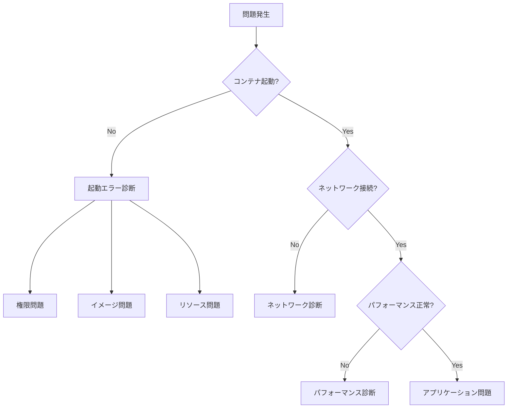

# Podman実践的トラブルシューティングガイド

本ガイドは、Podman運用で実際に遭遇する問題とその解決方法を、具体的な手順とともに解説します。

## トラブルシューティングの基本アプローチ

### 診断フローチャート

<a id="figure-troubleshooting-flow"></a>


```mermaid
graph TD
    A[問題発生] --> B{コンテナ起動?}
    B -->|No| C[起動エラー診断]
    B -->|Yes| D{ネットワーク接続?}
    
    C --> E[権限問題]
    C --> F[イメージ問題]
    C --> G[リソース問題]
    
    D -->|No| H[ネットワーク診断]
    D -->|Yes| I{パフォーマンス正常?}
    
    I -->|No| J[パフォーマンス診断]
    I -->|Yes| K[アプリケーション問題]
```

### 基本診断コマンド

```bash
#!/bin/bash
# podman-diagnose.sh - Podman環境の基本診断

echo "=== Podman環境診断 ==="
echo ""

# 1. バージョン情報
echo "[INFO] バージョン情報:"
podman version

# 2. システム情報
echo -e "\n[INFO] システム情報:"
podman info --format json | jq '{
  host: {
    os: .host.os,
    kernel: .host.kernel,
    arch: .host.arch,
    rootless: .host.rootless,
    cgroupVersion: .host.cgroupVersion
  },
  store: {
    driver: .store.graphDriverName,
    root: .store.graphRoot,
    runRoot: .store.runRoot
  }
}'

# 3. 実行中のコンテナ
echo -e "\n[INFO] 実行中のコンテナ:"
podman ps --format "table \{\{.Names\}\}\t\{\{.Status\}\}\t\{\{.State\}\}"

# 4. システムリソース
echo -e "\n[INFO] システムリソース:"
podman system df

# 5. ネットワーク
echo -e "\n[INFO] ネットワーク:"
podman network ls

# 6. 最近のイベント
echo -e "\n[INFO] 最近のイベント (エラーのみ):"
podman events --since 1h --filter event=died --format json | jq '.'
```

## 起動エラーの解決

### 1. Permission Denied エラー

#### 症状
```bash
$ podman run alpine ls
Error: OCI runtime error: permission denied
```

#### 診断と解決
```bash
#!/bin/bash
# fix-permission-denied.sh

echo "権限問題の診断開始..."

# 1. SELinuxステータス確認
if command -v getenforce &> /dev/null; then
    selinux_status=$(getenforce)
    echo "SELinux: $selinux_status"
    
    if [ "$selinux_status" = "Enforcing" ]; then
        echo "[WARN] SELinux が原因の可能性がある"
        
        # SELinuxコンテキストの修正
        echo "SELinuxコンテキストを修正中..."
        restorecon -R ~/.local/share/containers
        
        # 一時的な回避策（テスト用）
        echo "テスト実行（SELinux無効）:"
        podman run --security-opt label=disable alpine ls
    fi
fi

# 2. ユーザー名前空間確認
echo -e "\nユーザー名前空間の確認:"
if [ -f /proc/sys/kernel/unprivileged_userns_clone ]; then
    userns_enabled=$(cat /proc/sys/kernel/unprivileged_userns_clone)
    if [ "$userns_enabled" = "0" ]; then
        echo "[NG] ユーザー名前空間が無効"
        echo "修正方法:"
        echo "sudo sysctl -w kernel.unprivileged_userns_clone=1"
        echo "永続化: echo 'kernel.unprivileged_userns_clone=1' | sudo tee /etc/sysctl.d/userns.conf"
    else
        echo "[OK] ユーザー名前空間は有効"
    fi
fi

# 3. subuid/subgid確認
echo -e "\nUID/GIDマッピング:"
if ! grep -q "^$USER:" /etc/subuid; then
    echo "[NG] subuid エントリがない"
    echo "修正方法:"
    echo "sudo usermod --add-subuids 100000-165535 $USER"
else
    echo "[OK] subuid: $(grep "^$USER:" /etc/subuid)"
fi

if ! grep -q "^$USER:" /etc/subgid; then
    echo "[NG] subgid エントリがない"
    echo "修正方法:"
    echo "sudo usermod --add-subgids 100000-165535 $USER"
else
    echo "[OK] subgid: $(grep "^$USER:" /etc/subgid)"
fi

# 4. ストレージ権限
echo -e "\nストレージディレクトリ権限:"
storage_dirs=(
    "$HOME/.local/share/containers"
    "$HOME/.config/containers"
    "$XDG_RUNTIME_DIR/containers"
)

for dir in "${storage_dirs[@]}"; do
    if [ -d "$dir" ]; then
        perms=$(stat -c "%a %U:%G" "$dir")
        echo "$dir: $perms"
    else
        echo "$dir: 存在しません（作成されます）"
    fi
done
```

### 2. イメージプルエラー

#### 症状
```bash
$ podman pull myregistry.com/myimage:latest
Error: initializing source docker://myregistry.com/myimage:latest: pinging container registry myregistry.com: Get "https://myregistry.com/v2/": x509: certificate signed by unknown authority
```

#### 診断と解決
```bash
#!/bin/bash
# fix-registry-errors.sh

registry_url=$1
if [ -z "$registry_url" ]; then
    echo "使用方法: $0 <registry_url>"
    exit 1
fi

echo "レジストリ接続問題の診断: $registry_url"

# 1. DNS解決確認
echo -e "\n1. DNS解決テスト:"
if host $registry_url > /dev/null 2>&1; then
    echo "[OK] DNS 解決成功"
    host $registry_url | head -3
else
    echo "[NG] DNS 解決失敗"
    echo "対処法: /etc/resolv.confを確認してください"
fi

# 2. ネットワーク接続性
echo -e "\n2. ネットワーク接続性:"
if curl -k -s -o /dev/null -w "%{http_code}" https://$registry_url/v2/ | grep -q "401\|200"; then
    echo "[OK] レジストリに到達可能"
else
    echo "[NG] レジストリに到達不可"
    echo "ファイアウォールやプロキシ設定を確認してください"
fi

# 3. TLS証明書確認
echo -e "\n3. TLS証明書の確認:"
echo | openssl s_client -servername $registry_url -connect $registry_url:443 2>/dev/null | \
    openssl x509 -noout -text | grep -E "Subject:|Issuer:|Not After"

# 4. 自己署名証明書の場合の対処
echo -e "\n4. 自己署名証明書の設定方法:"
cat << EOF
# 方法1: 証明書を信頼済みに追加
sudo mkdir -p /etc/containers/certs.d/$registry_url
sudo cp registry-ca.crt /etc/containers/certs.d/$registry_url/ca.crt

# 方法2: insecureレジストリとして設定
echo '[[registry]]
location = "$registry_url"
insecure = true' | sudo tee -a /etc/containers/registries.conf

# 方法3: 一時的にスキップ
podman pull --tls-verify=false $registry_url/image:tag
EOF

# 5. 認証設定
echo -e "\n5. レジストリ認証:"
if podman login --get-login $registry_url > /dev/null 2>&1; then
    echo "[OK] 認証情報が保存されている"
else
    echo "[WARN] 認証が必要な場合:"
    echo "podman login $registry_url"
fi
```

### 3. ストレージ容量不足

#### 症状
```bash
$ podman pull large-image:latest
Error: writing blob: write /var/tmp/storage123/layer.tar: no space left on device
```

#### 診断と解決
```bash
#!/bin/bash
# fix-storage-issues.sh

echo "ストレージ問題の診断..."

# 1. ディスク使用状況
echo "ディスク使用状況:"
df -h | grep -E "Filesystem|podman|containers|overlay|/var|/home|/$"

# 2. Podmanストレージ使用状況
echo -e "\nPodmanストレージ分析:"
podman system df -v

# 3. 大きなイメージ/コンテナの特定
echo -e "\n大きなイメージ (上位10):"
podman images --format "table \{\{.Repository\}\}:\{\{.Tag\}\}\t\{\{.Size\}\}" | sort -k2 -hr | head -10

echo -e "\n大きなコンテナ (上位10):"
podman ps -a --format "table \{\{.Names\}\}\t\{\{.Size\}\}" | sort -k2 -hr | head -10

# 4. クリーンアップ提案
echo -e "\nクリーンアップオプション:"

# 未使用イメージ
unused_images=$(podman images -f dangling=true -q | wc -l)
if [ $unused_images -gt 0 ]; then
    echo "- 未使用イメージ: $unused_images 個"
    echo "  削除: podman image prune"
fi

# 停止中のコンテナ
stopped_containers=$(podman ps -a -f status=exited -q | wc -l)
if [ $stopped_containers -gt 0 ]; then
    echo "- 停止中のコンテナ: $stopped_containers 個"
    echo "  削除: podman container prune"
fi

# 未使用ボリューム
unused_volumes=$(podman volume ls -f dangling=true -q | wc -l)
if [ $unused_volumes -gt 0 ]; then
    echo "- 未使用ボリューム: $unused_volumes 個"
    echo "  削除: podman volume prune"
fi

# 5. 自動クリーンアップスクリプト
echo -e "\n自動クリーンアップスクリプト:"
cat << 'EOF'
#!/usr/bin/env bash
# auto-cleanup.sh - 定期実行用（注意: 影響範囲を理解した上で利用する）

set -euo pipefail

# 誤実行防止: 明示的に有効化しない限り動かない
if [ "${PODMAN_AUTO_CLEANUP:-NO}" != "YES" ]; then
  echo "[ABORT] Set PODMAN_AUTO_CLEANUP=YES to enable cleanup." >&2
  exit 1
fi

# 30日以上古いイメージを削除
# 影響が大きい（未使用イメージも削除されるため注意）
podman image prune --all --filter "until=720h" --force

# 終了したコンテナを削除
podman container prune --force

# 未使用ネットワーク等を削除（影響が大きい）
podman system prune --force

# ボリューム削除はデータ消失につながるため、明示的に opt-in（必要時のみ）
if [ "${PRUNE_VOLUMES:-NO}" = "YES" ]; then
  podman volume prune --force
  podman system prune --volumes --force
fi
EOF
```

## ネットワーク問題の解決

### 1. コンテナ間通信不可

#### 症状
```bash
# Container A から Container B に接続できない
$ podman exec container-a ping container-b
ping: container-b: Name or service not known
```

#### 診断と解決
```bash
#!/bin/bash
# fix-network-connectivity.sh

echo "コンテナネットワーク診断..."

# 1. ネットワーク構成の確認
echo "ネットワーク一覧:"
podman network ls

echo -e "\nデフォルトネットワークの詳細:"
podman network inspect podman | jq '.[0] | {
    name: .name,
    driver: .driver,
    subnet: .subnets[0].subnet,
    gateway: .subnets[0].gateway
}'

# 2. コンテナのネットワーク設定確認
container_name=${1:-"container-a"}
echo -e "\nコンテナ '$container_name' のネットワーク設定:"
podman inspect $container_name | jq '.[0].NetworkSettings | {
    Networks: .Networks,
    IPAddress: .IPAddress,
    Gateway: .Gateway
}'

# 3. 同一ネットワーク上での通信設定
echo -e "\n解決方法:"
cat << 'EOF'
# 方法1: 同じカスタムネットワークを使用
podman network create myapp-net
podman run -d --name app1 --network myapp-net alpine sleep 3600
podman run -d --name app2 --network myapp-net alpine sleep 3600

# 方法2: 既存コンテナをネットワークに接続
podman network connect myapp-net existing-container

# 方法3: Pod内で実行（localhost通信可能）
podman pod create --name myapp-pod
podman run -d --pod myapp-pod --name web nginx
podman run -d --pod myapp-pod --name app python:alpine
EOF

# 4. ネットワークデバッグツール
echo -e "\nデバッグコマンド:"
cat << 'EOF'
# DNS解決テスト
podman exec container-a nslookup container-b

# ネットワーク経路確認
podman exec container-a traceroute container-b

# ポート開放確認
podman exec container-a nc -zv container-b 80
EOF
```

### 2. ホストからコンテナへのアクセス不可

#### 症状
```bash
$ curl http://localhost:8080
curl: (7) Failed to connect to localhost port 8080: Connection refused
```

#### 診断と解決
```bash
#!/bin/bash
# fix-port-mapping.sh

port=${1:-8080}
echo "ポートマッピング診断 (ポート: $port)"

# 1. ポートマッピング確認
echo -e "\nポートマッピング状態:"
podman port --all | grep -E ":$port|Port"

# 2. リッスンポート確認
echo -e "\nシステムのリッスンポート:"
ss -tlnp | grep ":$port" || echo "ポート $port でリッスンしているプロセスなし"

# 3. ファイアウォール確認
echo -e "\nファイアウォール状態:"
if command -v firewall-cmd &> /dev/null; then
    sudo firewall-cmd --list-ports
    
    # ポート開放が必要な場合
    echo -e "\nポート開放コマンド:"
    echo "sudo firewall-cmd --add-port=$port/tcp --permanent"
    echo "sudo firewall-cmd --reload"
fi

# 4. iptables確認（rootlessの場合）
echo -e "\niptablesルール (rootless):"
if [ -f /proc/sys/net/ipv4/ip_forward ]; then
    ip_forward=$(cat /proc/sys/net/ipv4/ip_forward)
    echo "IP転送: $ip_forward"
    if [ "$ip_forward" = "0" ]; then
        echo "[WARN] IP転送が無効"
        echo "有効化: echo 1 | sudo tee /proc/sys/net/ipv4/ip_forward"
    fi
fi

# 5. 正しいポートマッピング例
echo -e "\n正しいポートマッピング方法:"
cat << EOF
# 基本的なマッピング
podman run -d -p 8080:80 nginx

# 特定インターフェースにバインド
podman run -d -p 127.0.0.1:8080:80 nginx

# 全インターフェースにバインド
podman run -d -p 0.0.0.0:8080:80 nginx

# 複数ポート
podman run -d -p 8080:80 -p 8443:443 nginx
EOF
```

## パフォーマンス問題の解決

### 1. コンテナの起動が遅い

#### 診断と解決
```bash
#!/bin/bash
# analyze-slow-startup.sh

container=${1:-"test-container"}
image=${2:-"alpine"}

echo "起動パフォーマンス分析..."

# 1. 起動時間の計測
echo -e "\n起動時間計測:"
time_output=$(time -p podman run --rm --name $container $image echo "Started" 2>&1)
echo "$time_output"

# 2. 起動プロセスの詳細分析
echo -e "\n詳細なタイミング分析:"
podman --log-level=debug run --rm $image true 2>&1 | grep -E "time=|duration=" | tail -20

# 3. ストレージドライバーの確認
echo -e "\nストレージドライバー:"
storage_driver=$(podman info --format '\{\{.Store.GraphDriverName\}\}')
echo "現在のドライバー: $storage_driver"

if [ "$storage_driver" != "overlay" ]; then
    echo "[WARN] 最適でないストレージドライバーを使用中"
    echo "推奨: overlay (native) または overlay (fuse-overlayfs)"
fi

# 4. イメージレイヤーの分析
echo -e "\nイメージレイヤー分析:"
podman history --format "table \{\{.ID\}\}\t\{\{.Size\}\}\t\{\{.CreatedBy\}\}" $image | head -10

# 5. 最適化の提案
echo -e "\nパフォーマンス改善方法:"
cat << EOF
1. イメージの最適化
   - マルチステージビルドの使用
   - レイヤー数の削減
   - ベースイメージの軽量化

2. ストレージの最適化
   - overlayドライバーの使用
   - SSDの使用
   - 定期的なガベージコレクション

3. システムチューニング
   - vm.max_map_count の増加
   - ulimitの調整
   - cgroup v2の使用
EOF
```

### 2. メモリ使用量が多い

#### 診断と解決
```bash
#!/bin/bash
# analyze-memory-usage.sh

echo "メモリ使用状況の分析..."

# 1. 全体的なメモリ使用状況
echo "システムメモリ状態:"
free -h

# 2. コンテナごとのメモリ使用量
echo -e "\nコンテナメモリ使用量:"
podman stats --no-stream --format "table \{\{.Name\}\}\t\{\{.MemUsage\}\}\t\{\{.MemPerc\}\}\t\{\{.PIDs\}\}"

# 3. 詳細なメモリ分析
echo -e "\nメモリ詳細分析:"
for container in $(podman ps --format "\{\{.Names\}\}"); do
    echo -e "\n--- $container ---"
    
    # cgroupメモリ情報
    podman exec $container cat /sys/fs/cgroup/memory.current 2>/dev/null | \
        numfmt --to=iec --suffix=B --format="%.2f" | \
        xargs echo "現在の使用量:"
    
    podman exec $container cat /sys/fs/cgroup/memory.max 2>/dev/null | \
        numfmt --to=iec --suffix=B --format="%.2f" 2>/dev/null | \
        xargs echo "制限値:"
    
    # プロセス情報
    echo "上位プロセス:"
    podman exec $container ps aux --sort=-%mem | head -5
done

# 4. メモリリークの検出
echo -e "\nメモリリーク検出:"
cat << 'EOF'
#!/bin/bash
# memory-leak-detector.sh
container=$1
duration=${2:-60}

echo "メモリ使用量を${duration}秒間監視..."

for i in $(seq 1 $duration); do
    mem=$(podman stats --no-stream --format "\{\{.MemUsage\}\}" $container | cut -d'/' -f1)
    echo "$(date +%H:%M:%S) - $mem"
    sleep 1
done | tee memory-trend.log

# 増加傾向の分析
echo "メモリ増加率の計算..."
python3 - memory-trend.log <<'PY'
import re
import sys
from typing import Optional


path = sys.argv[1]
unit_to_bytes = {
    "B": 1,
    "KB": 1000,
    "MB": 1000**2,
    "GB": 1000**3,
    "TB": 1000**4,
    "KiB": 1024,
    "MiB": 1024**2,
    "GiB": 1024**3,
    "TiB": 1024**4,
}


def to_bytes(value: str) -> Optional[float]:
    value = value.strip()
    match = re.match(r"^([0-9.]+)\s*([A-Za-z]+)$", value)
    if not match:
        return None
    number = float(match.group(1))
    unit = match.group(2)
    multiplier = unit_to_bytes.get(unit)
    if multiplier is None:
        return None
    return number * multiplier


values = []
with open(path, encoding="utf-8") as file:
    for line in file:
        line = line.strip()
        parts = line.split(" - ", 1)
        if len(parts) != 2:
            continue
        bytes_value = to_bytes(parts[1])
        if bytes_value is None:
            continue
        values.append(bytes_value)


if len(values) < 2:
    print("メモリ使用量ログが不足しています。")
    sys.exit(1)

delta = values[-1] - values[0]
rate = delta / (len(values) - 1)

print(f"開始: {values[0]:.0f} B")
print(f"終了: {values[-1]:.0f} B")
print(f"差分: {delta:.0f} B")
print(f"平均増加（1サンプルあたり）: {rate:.0f} B")

threshold = 10 * 1024  # 1サンプルあたり10KiB以上の増加をリーク疑いとみなす
if rate > threshold:
    print(f"判定: 増加傾向あり（リーク疑い、平均 {rate/1024:.1f} KiB/サンプル）")
elif delta > 0:
    print(f"判定: 微増傾向（要観察、平均 {rate:.0f} B/サンプル）")
else:
    print("判定: 増加傾向なし（安定）")
PY
EOF

# 5. 最適化提案
echo -e "\nメモリ最適化方法:"
echo "1. メモリ制限の設定: podman run -m 512m"
echo "2. スワップ制限: podman run -m 512m --memory-swap 512m"
echo "3. OOMキラーの調整: podman run --oom-kill-disable=false"
```

## 高度なトラブルシューティング

### 1. systemd統合の問題

#### 症状
```bash
$ systemctl --user start podman-myapp
Failed to start podman-myapp.service: Unit not found.
```

#### 診断と解決

2026年5月23日時点では、`podman generate systemd` は deprecated です。既存の生成済み
unit を調査する場合を除き、新規の systemd 連携は Quadlet 定義から確認します。

```bash
#!/bin/bash
# fix-systemd-integration.sh

container_name=${1:-"myapp"}
quadlet_dir="${XDG_CONFIG_HOME:-$HOME/.config}/containers/systemd"
quadlet_file="$quadlet_dir/${container_name}.container"

echo "systemd統合の診断..."

# 1. Quadlet 定義の確認
echo -e "\nQuadlet定義の確認:"
mkdir -p "$quadlet_dir"
if [ ! -f "$quadlet_file" ]; then
    cat > "$quadlet_file" << EOF
[Unit]
Description=Podman container ${container_name}
Wants=network-online.target
After=network-online.target

[Container]
Image=localhost/${container_name}:latest
ContainerName=${container_name}

[Service]
Restart=on-failure

[Install]
WantedBy=default.target
EOF
    echo "サンプル Quadlet を作成しました: $quadlet_file"
    echo "Image= と PublishPort= / Volume= などは実環境に合わせてレビューしてください。"
else
    echo "既存 Quadlet を検出しました: $quadlet_file"
fi

echo "Quadlet定義:"
cat "$quadlet_file"

# 2. systemd への反映
echo -e "\nsystemdへの反映:"
systemctl --user daemon-reload
systemctl --user list-unit-files | grep "${container_name}.service" || true

# 3. 自動起動の設定
echo -e "\nサービスの管理:"
cat << EOF
# サービスの有効化と起動
# Quadlet の [Install] で有効化先を定義したうえで enable する
systemctl --user enable --now ${container_name}.service

# 状態確認
systemctl --user status ${container_name}.service

# ログ確認
journalctl --user -u ${container_name}.service
EOF

# 4. トラブルシューティングチェックリスト
echo -e "\nチェックリスト:"
echo "- [ ] loginctl show-user でLinger=yes確認"
echo "- [ ] XDG_RUNTIME_DIR が設定されている"
echo "- [ ] systemd --user が実行されている"
echo "- [ ] Quadlet定義が ${quadlet_dir} 配下にある"
echo "- [ ] Image / PublishPort / Volume / Environment が実環境向けにレビュー済み"
```

### 2. cgroup v2関連の問題

#### 診断と解決
```bash
#!/bin/bash
# fix-cgroup-issues.sh

echo "cgroup設定の診断..."

# 1. cgroupバージョン確認
echo "cgroupバージョン:"
if [ -f /sys/fs/cgroup/cgroup.controllers ]; then
    echo "cgroup v2 が有効"
    echo "利用可能なコントローラー:"
    cat /sys/fs/cgroup/cgroup.controllers
else
    echo "cgroup v1 が有効"
    echo "[WARN] cgroup v2 への移行を推奨"
fi

# 2. 委譲設定の確認
echo -e "\nsystemd委譲設定:"
systemctl show --user -p Delegate
systemctl show --user -p DelegateControllers

# 3. ユーザースライスの設定
echo -e "\nユーザースライス設定:"
cat << 'EOF'
# /etc/systemd/system/user@.service.d/delegate.conf
[Service]
Delegate=cpu cpuset io memory pids
EOF

# 4. リソース制限の適用確認
echo -e "\nリソース制限テスト:"
podman run --rm --memory 100m --cpus 0.5 alpine sh -c '
    echo "メモリ制限: $(cat /sys/fs/cgroup/memory.max | numfmt --to=iec)"
    echo "CPU制限: $(cat /sys/fs/cgroup/cpu.max)"
'
```

## トラブルシューティングチェックリスト

### 起動時の問題
- [ ] SELinuxの状態確認 (`getenforce`)
- [ ] ユーザー名前空間の有効化
- [ ] subuid/subgidの設定
- [ ] ストレージディレクトリの権限

### ネットワークの問題
- [ ] ファイアウォールルール
- [ ] ポートの競合確認
- [ ] IP転送の有効化
- [ ] DNSの設定

### パフォーマンスの問題
- [ ] ストレージドライバーの最適化
- [ ] cgroupの設定
- [ ] システムリソースの確認
- [ ] カーネルパラメータの調整

### 運用の問題
- [ ] ログローテーション設定
- [ ] 監視エージェントの動作
- [ ] バックアップスクリプトの実行
- [ ] 自動クリーンアップの設定

## 緊急時の対処法

```bash
#!/usr/bin/env bash
# emergency-recovery.sh

set -euo pipefail

echo "緊急リカバリ手順..."
echo
echo "[WARNING] このスクリプトは Podman のデータを削除します。"
echo "  - podman system reset（イメージ/コンテナ/ネットワーク等の削除）"
echo "  - ~/.config/containers と ~/.local/share/containers の退避（必要なら削除）"
echo
echo "原則としてテスト環境でのみ使用し、本番環境では実行しないでください。"
echo "実行する場合は、事前に影響範囲を確認し、必要なデータをバックアップしてください。"
echo

if [ "${PODMAN_EMERGENCY_RECOVERY:-}" != "YES" ]; then
  echo "[ABORT] 実行を中止しました。"
  echo "実行する場合は、環境変数 PODMAN_EMERGENCY_RECOVERY=YES を設定して再実行してください。"
  exit 1
fi

read -r -p "本当に実行しますか？（実行する場合は 'yes' と入力）: " answer
if [ "$answer" != "yes" ]; then
  echo "[ABORT] 中止しました。"
  exit 1
fi

backup_dir="$HOME/podman-emergency-backup-$(date +%Y%m%d_%H%M%S)"
mkdir -p "$backup_dir"

# 1. 全コンテナの停止（存在しない場合もあるため失敗しても継続）
echo "1. 全コンテナ停止"
podman stop --all --time 0 || true

# 2. 設定とデータの退避（reset 前にコピーして保全）
echo "2. 設定とデータの退避: $backup_dir"
if [ -d "$HOME/.config/containers" ]; then
  cp -a "$HOME/.config/containers" "$backup_dir/containers.config"
fi
if [ -d "$HOME/.local/share/containers" ]; then
  cp -a "$HOME/.local/share/containers" "$backup_dir/containers.data"
fi

# 3. ネットワークのリセット（注意: 未使用ネットワークが削除される）
echo "3. ネットワークリセット"
podman network prune

# 4. ストレージのリセット（注意: データ消失）
echo "4. ストレージクリーンアップ（データ消失）"
podman system reset

# 5. 再起動（必要に応じて）
echo "5. 必要に応じてシステム再起動を検討してください"
```

## まとめ

トラブルシューティングは、問題の正確な診断から始まります。本ガイドで紹介したツールとテクニックを活用し、システマティックなアプローチで問題解決にあたってください。

重要なのは、問題が発生する前の予防的な対策です。定期的な監視、適切なリソース管理、そして継続的なメンテナンスにより、多くの問題を未然に防ぐことができます。
