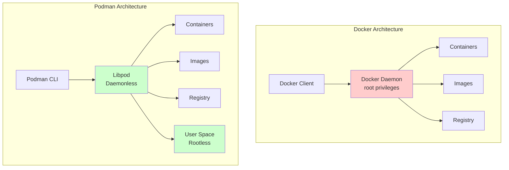
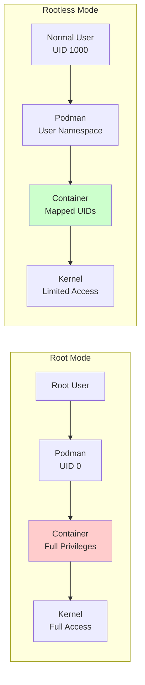
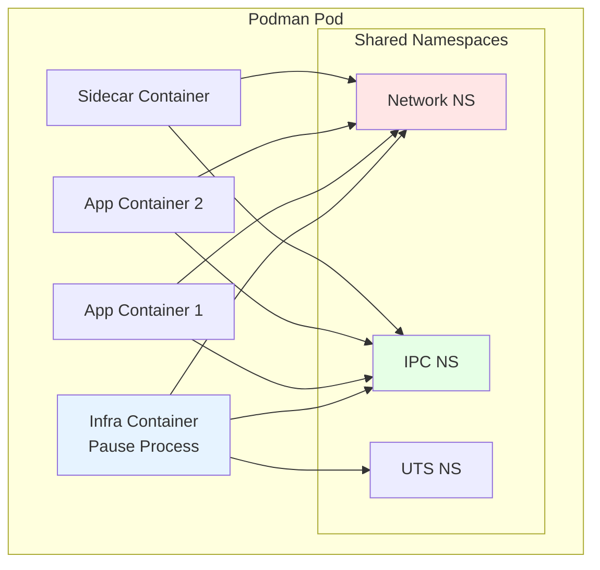
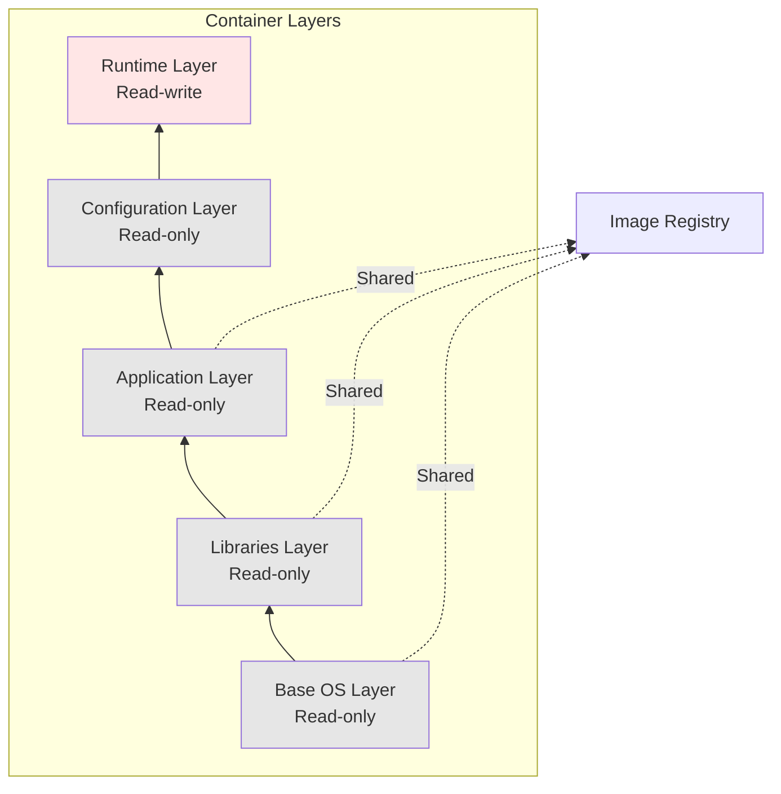
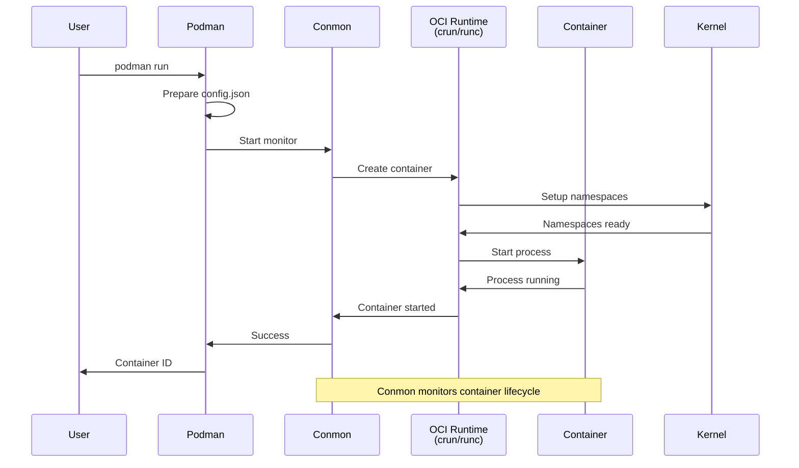

# Podman Architecture Diagrams

## Docker vs Podman Architecture Comparison

```mermaid
graph TB
    subgraph "Docker Architecture"
        DClient[Docker Client]
        DDaemon[Docker Daemon<br/>root privileges]
        DContainers[Containers]
        DImages[Images]
        DRegistry[Registry]
        
        DClient --> DDaemon
        DDaemon --> DContainers
        DDaemon --> DImages
        DDaemon --> DRegistry
    end
    
    subgraph "Podman Architecture"
        PClient[Podman CLI]
        PLibpod[Libpod<br/>Daemonless]
        PContainers[Containers]
        PImages[Images]
        PRegistry[Registry]
        PUser[User Space<br/>Rootless]
        
        PClient --> PLibpod
        PLibpod --> PContainers
        PLibpod --> PImages
        PLibpod --> PRegistry
        PLibpod --> PUser
    end
    
    style DDaemon fill:#ffcccc
    style PLibpod fill:#ccffcc
    style PUser fill:#ccffcc
```

## Rootless vs Root Container Execution

```mermaid
flowchart LR
    subgraph "Root Mode"
        RootUser[Root User]
        RootPodman[Podman<br/>UID 0]
        RootContainer[Container<br/>Full Privileges]
        RootKernel[Kernel<br/>Full Access]
        
        RootUser --> RootPodman
        RootPodman --> RootContainer
        RootContainer --> RootKernel
    end
    
    subgraph "Rootless Mode"
        NormalUser[Normal User<br/>UID 1000]
        UserPodman[Podman<br/>User Namespace]
        UserContainer[Container<br/>Mapped UIDs]
        UserKernel[Kernel<br/>Limited Access]
        
        NormalUser --> UserPodman
        UserPodman --> UserContainer
        UserContainer --> UserKernel
    end
    
    style RootContainer fill:#ffcccc
    style UserContainer fill:#ccffcc
```

## Pod Architecture

```mermaid
graph TD
    subgraph "Podman Pod"
        InfraContainer[Infra Container<br/>Pause Process]
        
        subgraph "Shared Namespaces"
            Network[Network NS]
            IPC[IPC NS]
            UTS[UTS NS]
        end
        
        Container1[App Container 1]
        Container2[App Container 2]
        Container3[Sidecar Container]
        
        InfraContainer --> Network
        InfraContainer --> IPC
        InfraContainer --> UTS
        
        Container1 --> Network
        Container2 --> Network
        Container3 --> Network
        
        Container1 --> IPC
        Container2 --> IPC
        Container3 --> IPC
    end
    
    style InfraContainer fill:#e6f3ff
    style Network fill:#ffe6e6
    style IPC fill:#e6ffe6
```

## Container Image Layers

```mermaid
graph BT
    subgraph "Container Layers"
        Base[Base OS Layer<br/>Read-only]
        Lib[Libraries Layer<br/>Read-only]
        App[Application Layer<br/>Read-only]
        Config[Configuration Layer<br/>Read-only]
        Runtime[Runtime Layer<br/>Read-write]
    end
    
    Base --> Lib
    Lib --> App
    App --> Config
    Config --> Runtime
    
    Base -.->|Shared| Image1[Image Registry]
    Lib -.->|Shared| Image1
    App -.->|Shared| Image1
    
    style Base fill:#e6e6e6
    style Lib fill:#e6e6e6
    style App fill:#e6e6e6
    style Config fill:#e6e6e6
    style Runtime fill:#ffe6e6
```

## OCI Runtime Flow

```mermaid
sequenceDiagram
    participant User
    participant Podman
    participant Conmon
    participant Runtime as OCI Runtime<br/>(crun/runc)
    participant Container
    participant Kernel
    
    User->>Podman: podman run
    Podman->>Podman: Prepare config.json
    Podman->>Conmon: Start monitor
    Conmon->>Runtime: Create container
    Runtime->>Kernel: Setup namespaces
    Kernel->>Runtime: Namespaces ready
    Runtime->>Container: Start process
    Container->>Runtime: Process running
    Runtime->>Conmon: Container started
    Conmon->>Podman: Success
    Podman->>User: Container ID
    
    Note over Conmon,Container: Conmon monitors container lifecycle
```