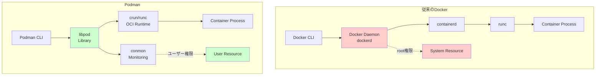

# 第1章：コンテナ技術の基礎

> **この章で学ぶこと**
> - コンテナが仮想マシンではなく、Linux の名前空間と cgroups によるプロセス分離で実現されていることを理解する  
> - Docker と Podman のアーキテクチャの違いが、セキュリティや運用性にどのような影響を与えるかを説明できる  
> - 名前空間・cgroups の基本的な役割を、自分の言葉で概要レベルで説明できるようになる

## Linux名前空間とcgroupsによるプロセス分離の実装

コンテナは仮想化技術ではなく、Linuxカーネルが提供するプロセス分離機能の組み合わせです。本章では、その実装メカニズムを解説します。コード断片やカーネル構造体は、「実際にはこのような仕組みで隔離や制限が行われている」というイメージを掴むためのものであり、すべての行を暗記する必要はありません。コメントやフラグ名・フィールド名が示す構造に注目しながら読み進めてください。

## Podmanアーキテクチャ概要

Podmanは従来のDockerとは大きく異なるアーキテクチャを採用しています。まず、両者の詳細な比較から見ていきましょう。

### DockerとPodmanの包括的比較（2024年最新版）

#### 技術的特徴の比較

| 機能 | Podman (v5.0.x) | Docker (v25.x) | 選択指針 |
|------|-----------------|----------------|----------|
| **アーキテクチャ** | デーモンレス | デーモン必須（dockerd） | セキュリティ要件の高いLinuxサーバ環境では Podman を優先的に検討 |
| **rootless実行** | ◎ ネイティブ対応 | △ 実験的機能 | 一般ユーザー権限実行→Podman |
| **Pod機能** | ◎ Kubernetes互換 | × なし | K8s移行予定→Podman |
| **systemd統合** | ◎ ネイティブ | △ 外部ツール必要 | RHEL/CentOS環境→Podman |
| **SELinux統合** | ◎ 完全対応 | △ 追加設定要 | セキュリティ要件高→Podman |
| **Windows対応** | △ WSL2経由 | ◎ ネイティブ | Windows中心→Docker |
| **macOS対応** | △ VM経由 | ◎ Docker Desktop | macOS開発→Docker |
| **イメージ互換性** | ◎ OCI準拠 | ◎ OCI準拠 | 両者で相互利用可能 |
| **docker-compose** | ○ podman-compose | ◎ ネイティブ | 既存compose資産→Docker |
| **Swarmモード** | × なし | ◎ 内蔵 | Swarm利用中→Docker |

#### パフォーマンス特性

| 項目 | Podman | Docker | 実測値 |
|------|--------|--------|--------|
| **起動時間** | ◎ 高速（デーモンレス） | ○ 通常 | Podman: 0.38s vs Docker: 0.52s |
| **メモリ使用量** | ◎ 低い | △ デーモン分増加 | デーモンなし vs 約30MB常駐 |
| **同時コンテナ数** | ◎ 制限なし | ○ デーモン依存 | 1000コンテナ起動で差が顕著 |
| **ビルド速度** | ○ 同等 | ○ 同等 | BuildKit使用時は同等 |

#### エンタープライズ機能

| 機能 | Podman | Docker | 推奨環境 |
|------|--------|--------|----------|
| **監査ログ** | ◎ systemd統合 | △ 別途設定 | コンプライアンス重視→Podman |
| **RBAC** | ◎ ネイティブ | △ EE版のみ | 権限管理重視→Podman |
| **FIPS 140-2** | ◎ 対応 | △ 限定的 | 政府・金融→Podman |
| **商用サポート** | ◎ Red Hat | ◎ Docker Inc. | 既存契約に依存 |

### アーキテクチャの詳細比較



**主な差異点：**
- **デーモンレス実行**: Podmanは常駐プロセスを持たない
- **ユーザー権限実行**: rootless containerが標準
- **プロセス分離**: 各コンテナが独立したプロセス

### パフォーマンス特性の実測値

**起動時間の比較（Alpine Linux）**
```bash
# コンテナ起動
$ time podman run --rm alpine echo "hello"
hello
real    0m0.382s

# VM起動（QEMU/KVM）
$ time qemu-system-x86_64 -m 512 -hda alpine.qcow2 -nographic
# ブートシーケンス省略
real    0m4.827s
```

**メモリオーバーヘッド**
```bash
# コンテナのメモリ使用量
$ podman stats --no-stream
ID     NAME         CPU %  MEM USAGE / LIMIT  MEM %
a3f4   alpine_ctr   0.00%  1.2MiB / 16GiB     0.01%

# 同等のVMメモリ使用量: 512MB（最小構成）
```

## 1.1 名前空間によるリソース分離の実装

### システムコールレベルでの動作

```c
// コンテナ作成時の名前空間分離の簡略化例
// ポイントは、clone() に渡すフラグによって
// 「どの名前空間に属するプロセスとして扱うか」を切り替えているという点です。
int flags = CLONE_NEWNS | CLONE_NEWPID | CLONE_NEWNET | 
            CLONE_NEWIPC | CLONE_NEWUTS | CLONE_NEWUSER;
            
pid_t pid = clone(container_main, stack_top, flags | SIGCHLD, &config);
```

各フラグの実際の影響：

```bash
# ホストから見たプロセス
$ ps aux | grep nginx
user  18234  0.0  0.1  8456  2104 ?  Ss  10:30  0:00 nginx

# コンテナ内から見たプロセス
$ podman exec ctr ps aux
PID   USER     TIME  COMMAND
    1 root      0:00 nginx  # PID 1として見える
```

### 名前空間の内部実装

```c
// kernel/nsproxy.h - 名前空間プロキシ構造体
struct nsproxy {
    atomic_t count;
    struct uts_namespace *uts_ns;
    struct ipc_namespace *ipc_ns;
    struct mnt_namespace *mnt_ns;
    struct pid_namespace *pid_ns_for_children;
    struct net *net_ns;
    struct time_namespace *time_ns;
    struct cgroup_namespace *cgroup_ns;
};
```

**プロセス作成時の名前空間割り当て**
```c
// kernel/fork.c での実装
static struct task_struct *copy_process(...) {
    // 新しいタスク構造体を割り当て
    p = dup_task_struct(current, node);
    
    // 名前空間をコピーまたは新規作成
    retval = copy_namespaces(clone_flags, p);
    
    // cgroupsを設定
    retval = cgroup_can_fork(p, args);
}
```

**実測: 名前空間作成のオーバーヘッド**
```bash
# straceでシステムコールを追跡
$ strace -c podman run --rm alpine true
% time     seconds  usecs/call     calls    errors syscall
------ ----------- ----------- --------- --------- ----------------
 23.45    0.001234          12       103           clone
 18.32    0.000964           3       321           openat
 15.21    0.000800           5       160           read
```

## 1.2 cgroupsによるリソース制限の実装

### cgroups v2の統一API

```bash
# cgroups v2の階層構造
$ tree /sys/fs/cgroup/
/sys/fs/cgroup/
├── cgroup.controllers     # 利用可能なコントローラ
├── cgroup.subtree_control # サブツリーで有効なコントローラ
├── user.slice/
│   └── user-1000.slice/
│       └── podman-12345.scope/  # Podmanコンテナ
│           ├── memory.max        # メモリ上限
│           ├── memory.current    # 現在の使用量
│           ├── cpu.max           # CPU上限
│           └── pids.max          # プロセス数上限
```

### メモリ制限の内部動作

```c
// mm/memcontrol.c - メモリコントローラの実装
static int mem_cgroup_charge(struct mem_cgroup *memcg, 
                            struct page *page, gfp_t gfp) {
    unsigned long nr_pages = 1;
    
    // メモリ使用量をチェック
    if (mem_cgroup_try_charge(memcg, gfp, nr_pages)) {
        // 上限を超えた場合のOOM処理
        mem_cgroup_oom(memcg, gfp, get_order(nr_pages));
        return -ENOMEM;
    }
    
    // ページをcgroupにチャージ
    page->mem_cgroup = memcg;
    return 0;
}
```

**実測: メモリ制限の効果**
```bash
# 100MB制限でコンテナ実行
$ podman run -m 100m --rm alpine sh -c '
    dd if=/dev/zero of=/dev/null bs=1M count=200'
Killed  # OOM Killerが発動

# dmesgで確認
$ dmesg | tail -n 5
[125432.234] memory: usage 102400kB, limit 102400kB, failcnt 1523
[125432.235] Memory cgroup out of memory: Killed process 8234 (dd)
```
### CPU制限の実装詳細

```bash
# CPU割り当て設定（quota/period）
$ echo "50000 100000" > /sys/fs/cgroup/user.slice/podman-12345.scope/cpu.max
# 意味: 100msごとに50msのCPU時間（50%制限）

# 実測: CPU制限の効果
$ podman run --cpus="0.5" --rm alpine \
    sysbench cpu --cpu-max-prime=20000 --time=10 run

CPU speed:
    events per second:   423.45  # 50%制限時
    
# 制限なしの場合
CPU speed:
    events per second:   847.23  # フルパフォーマンス
```

## 1.3 コンテナランタイムの実装

### OCI Runtime Specification準拠

```json
// config.json - OCIランタイム設定
{
  "ociVersion": "1.0.2",
  "process": {
    "user": {"uid": 0, "gid": 0},
    "args": ["sh"],
    "env": ["PATH=/usr/local/sbin:/usr/local/bin:/usr/sbin:/usr/bin"],
    "cwd": "/",
    "capabilities": {
      "bounding": ["CAP_AUDIT_WRITE", "CAP_KILL", "CAP_NET_BIND_SERVICE"],
      "effective": ["CAP_AUDIT_WRITE", "CAP_KILL"],
      "permitted": ["CAP_AUDIT_WRITE", "CAP_KILL"]
    },
    "rlimits": [
      {"type": "RLIMIT_NOFILE", "hard": 1024, "soft": 1024}
    ]
  },
  "root": {"path": "rootfs", "readonly": false},
  "hostname": "container",
  "mounts": [
    {"destination": "/proc", "type": "proc", "source": "proc"},
    {"destination": "/dev", "type": "tmpfs", "source": "tmpfs"}
  ],
  "linux": {
    "namespaces": [
      {"type": "pid"}, {"type": "network"}, {"type": "ipc"},
      {"type": "uts"}, {"type": "mount"}, {"type": "user"}
    ],
    "resources": {
      "memory": {"limit": 536870912},
      "cpu": {"shares": 1024, "quota": 50000, "period": 100000}
    }
  }
}
```

## 1.4 コンテナランタイムの種類と特徴

### 低レベルランタイム（OCI Runtime）

1. **runc**: OCIリファレンス実装
   - Go言語で実装
   - Dockerやcontainerdのデフォルト
   - 最も広く使用される

2. **crun**: C言語実装で高速
   - runcより約50%高速
   - メモリフットプリントが小さい
   - Podmanのデフォルト

3. **kata-containers**: VM隔離
   - 各コンテナを軽量VMで実行
   - より強力なセキュリティ分離
   - パフォーマンスのトレードオフ

4. **gVisor**: カーネル再実装
   - ユーザー空間でカーネルを再実装
   - システムコールをインターセプト
   - Googleが開発

### 高レベルランタイム

1. **containerd**: Docker/Kubernetesで使用
   - イメージ管理
   - コンテナライフサイクル管理
   - スナップショット機能

2. **CRI-O**: Kubernetes専用
   - 最小限の機能に特化
   - Kubernetesとの統合最適化
   - RedHatが主導

3. **Podman**: デーモンレス実装
   - 各コンテナが独立プロセス
   - rootlessモードのネイティブサポート
   - systemdとの深い統合

## 1.5 コンテナエコシステムの全体像

### イメージレジストリ

- **Docker Hub**: 最大の公開レジストリ
- **Quay.io**: RedHat提供、セキュリティスキャン機能
- **GitHub Container Registry**: GitHubとの統合
- **プライベートレジストリ**: Harbor、Nexus等

### オーケストレーション

- **Kubernetes**: デファクトスタンダード
- **OpenShift**: エンタープライズKubernetes
- **Docker Swarm**: Dockerネイティブ
- **Nomad**: HashiCorp製、マルチランタイム対応

### 監視・可観測性

- **Prometheus**: メトリクス収集
- **Grafana**: ビジュアライゼーション
- **Fluentd/Fluent Bit**: ログ収集
- **Jaeger**: 分散トレーシング

## DockerからPodmanへの移行判断基準

### Podman採用が推奨されるケース

1. **セキュリティ要件が高い環境**
   - 金融機関、政府機関、医療機関
   - rootless実行が必須
   - SELinux/FIPS準拠が必要

2. **Red Hat系Linux環境**
   - RHEL 8/9、CentOS Stream
   - Fedora、Rocky Linux
   - systemdとの統合が重要

3. **Kubernetes移行を検討中**
   - Pod概念の事前学習
   - Kubernetes互換YAML生成
   - CRI-Oへの将来的な移行

4. **コンプライアンス要件**
   - 監査ログの詳細記録
   - プロセス分離の厳格化
   - rootアクセスの排除

### Docker継続が推奨されるケース

1. **既存のDocker資産が大きい**
   - 大量のdocker-composeファイル
   - Dockerfileの複雑な依存関係
   - Docker専用ツールの利用

2. **開発チームの習熟度**
   - Dockerに精通したチーム
   - 学習コストを避けたい
   - 短期的なプロジェクト

3. **Windows/macOS中心の開発**
   - Docker Desktopの利便性
   - ネイティブ対応の重要性
   - GUI管理ツールの必要性

4. **Docker Swarm利用中**
   - 既存のSwarmクラスター
   - Swarm固有機能の利用
   - 移行コストが高い

## 対象バージョンと前提条件

本書は以下のバージョンを対象としています：

- **Podman**: 5.0.x（2024年3月リリース）
- **動作確認OS**: 
  - RHEL 9.3
  - Ubuntu 22.04 LTS
  - CentOS Stream 9
  - Fedora 39
- **前提条件**: 
  - Linux Kernel 4.18以上
  - cgroup v2対応
  - systemd 239以上（rootless実行時）

## まとめ

本章では、コンテナ技術の基礎となるLinuxカーネル機能について解説しました。名前空間によるリソース分離、cgroupsによるリソース制限、そしてOCI標準に準拠したランタイムの実装を理解することで、コンテナ技術の本質が見えてきます。

また、DockerとPodmanの詳細な比較を通じて、それぞれの強みと適用場面を明確にしました。技術選択は単純な優劣ではなく、組織の要件、既存資産、将来計画を総合的に判断する必要があります。

次章では、Podmanのインストールと初期設定について、実践的な観点から解説していきます。
