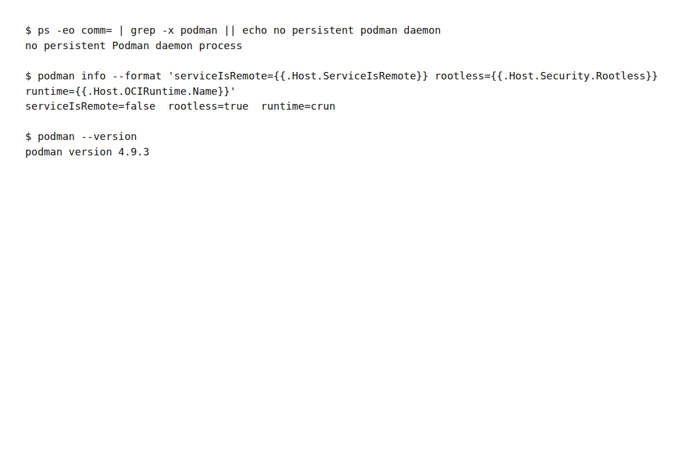
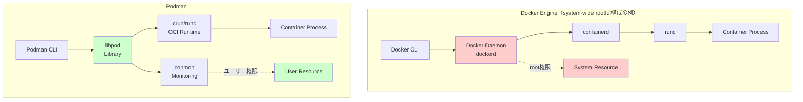

# 第1章：コンテナ技術の基礎

> **この章で学ぶこと**
> - コンテナが仮想マシンではなく、Linux の名前空間と cgroups によるプロセス分離で実現されていることを理解する  
> - Docker と Podman のアーキテクチャの違いが、セキュリティや運用性にどのような影響を与えるかを説明できる  
> - 名前空間・cgroups の基本的な役割を、自分の言葉で概要レベルで説明できるようになる

## Linux名前空間とcgroupsによるプロセス分離の実装

コンテナは仮想化技術ではなく、Linuxカーネルが提供するプロセス分離機能の組み合わせです。本章では、その実装メカニズムを解説します。コード断片やカーネル構造体は、「実際にはこのような仕組みで隔離や制限が行われている」というイメージを掴むためのものであり、すべての行を暗記する必要はありません。コメントやフラグ名・フィールド名が示す構造に注目しながら読み進めてください。

## Podmanアーキテクチャ概要

PodmanとDocker EngineはいずれもOCI containerを扱えますが、local Linuxでのprocess model、API endpoint、rootlessの有効化方法が異なります。製品名だけで優劣を決めず、運用するmodeと前提条件を揃えて比較します。

<a id="figure-daemonless-process-audit"></a>



_2026-07-23（JST）、Ubuntu 24.04.3 LTS（WSL2）/ rootless Podman 4.9.3。常駐Podman processがないこと、remote serviceではないこと、runtimeとversionを確認します。Docker daemonを利用できない撮影環境のため、Docker側のprocess比較は上の概念表で確認してください。_

### DockerとPodmanの比較（確認日: 2026-07-21）

#### 技術的特徴の比較

| 比較軸 | Podman | Docker Engine | 判断時に確認すること |
|---|---|---|---|
| **local Linuxのprocess model** | 通常のCLI操作では中央daemonを常駐させない。APIが必要な場合は`podman system service`を明示的に使用 | CLIが長時間稼働する`dockerd`へ接続。rootless modeでもuser所有のdaemonを使用 | daemon lifecycle、socket権限、API互換性 |
| **rootlessのstatus** | non-root userが直接containerを起動できるsupported mode | Docker Engine 20.10でexperimentalを卒業したsupported mode。daemonとcontainerをuser namespace内で実行 | どちらもsupportedであり、「対応済み対実験的」という比較をしない |
| **rootlessの有効化** | 一般userで実行し、`subuid` / `subgid`、user namespace、storage、networkを確認 | `dockerd-rootless-setuptool.sh install`でuser serviceと`rootless` contextを設定 | system-wide rootful daemonとの併存、CLI context、socket path |
| **resource制御** | rootlessで利用できるcontrollerはcgroup v2とsystemd user serviceへのdelegationに依存 | cgroup関連optionはcgroup v2とsystemdを満たす場合にsupported。条件外では一部optionが無視される | 対象hostでCPU / memory / PIDs制限を実測 |
| **API endpoint** | local CLIはdaemonless。Docker API互換endpointはoptional serviceとして公開 | CLIとtoolはDocker daemon socketへ接続 | IDE、CI、Compose等が必要とするAPIとsocket ownership |
| **Pod** | 複数containerをまとめるPod objectを提供 | Docker Engineに同一のPod objectはない | Kubernetes互換性ではなく、必要なlifecycle単位で判断 |
| **Compose** | `podman compose`はexternal Compose providerを呼び出す | Docker Compose pluginをDocker Engineと組み合わせる | 実際のCompose file、provider、CIで互換性を検証 |
| **systemd運用** | Quadletでcontainer / pod / volume等をunitへ宣言可能 | rootless daemonはsystemd user service、system-wide daemonはsystem serviceとして管理 | daemon有無ではなく、再起動・依存・権限の運用契約 |
| **Windows対応** | native CLI + Podman machine（WSL / Hyper-V guest） | Docker Desktop | providerと既存toolchainで選択 |
| **macOS対応** | native CLI + Podman machine（Linux VM） | Docker Desktop | どちらもLinux VMを使用 |
| **image format** | OCI / Docker imageを扱う | OCI / Docker imageを扱う | registry、manifest、build機能の差を別途検証 |
| **Swarm mode** | built-in Swarm modeはない | Docker Engineにbuilt-in | 既存Swarm workloadの有無 |

Docker rootlessはcontainer processだけをnon-rootにする設定や`userns-remap`とは異なり、Docker daemon自体もnon-root user namespace内で動作させます。rootless modeは[Docker Engine rootless](https://docs.docker.com/engine/security/rootless/)を正本とし、[Docker Engine 20.10 release notes](https://docs.docker.com/engine/release-notes/20.10/)でexperimental卒業を確認できます。resource制御とprivileged port等の条件は[Rootless tips](https://docs.docker.com/engine/security/rootless/tips/)で対象hostごとに確認します。

Podmanのdaemonless説明とrootless前提は[Podman stable documentation](https://docs.podman.io/en/stable/)および[Podman rootless mode](https://docs.podman.io/en/stable/markdown/podman.1.html#rootless-mode)を正本とします。macOS / Windowsのmachine経路は第2章の導入経路と合わせてください。

#### performanceとenterprise要件の比較方針

起動時間、常駐memory、同時container数、build速度は、engine version、runtime、storage、network、image cache、host負荷で変わります。本書では出典と再現条件のない単一値を製品の一般的な優劣へ拡張せず、対象workloadの同一条件で測定します。新しいbenchmarkを掲載する場合は、command、sample数、host、version、cache条件、raw resultを同時に記録します。

監査、SELinux、FIPS、RBAC、商用supportもengine名だけでは決まりません。利用するdistribution、Desktop / Engine edition、vendor contract、host policyを要件表へ落とし込み、提供元のsupport matrixで確認します。

### アーキテクチャの詳細比較

<a id="figure-container-technology-concepts"></a>


```mermaid
graph TB
    subgraph "Docker Engine（system-wide rootful構成の例）"
        D1[Docker CLI] --> D2[Docker Daemon<br/>dockerd]
        D2 --> D3[containerd]
        D3 --> D4[runc]
        D4 --> D5[Container Process]
        D2 -.->|root権限| D6[System Resource]
    end
    
    subgraph "Podman"
        P1[Podman CLI] --> P2[libpod<br/>Library]
        P2 --> P3[conmon<br/>Monitoring]
        P2 --> P4[crun/runc<br/>OCI Runtime]
        P4 --> P5[Container Process]
        P3 -.->|ユーザー権限| P6[User Resource]
    end
    
    style D2 fill:#ffcccc
    style P2 fill:#ccffcc
    style D6 fill:#ffcccc
    style P6 fill:#ccffcc
```

この図のDocker側はsystem-wide rootful daemonの例です。Docker rootlessでも`dockerd`を使用しますが、daemonとcontainerの双方をuser namespace内で実行します。Podman側もAPI serviceやmacOS / Windowsのremote machineを使う場合があるため、「Podmanには常にserviceがない」と一般化しません。

**主な差異点：**
- **process model**: local LinuxのPodman CLIは中央daemonを必須とせず、Docker CLIは選択したDocker daemonへ接続
- **rootless mode**: 両者ともsupported。Podmanはnon-root userが直接実行し、Dockerはrootless daemonとCLI contextを構成
- **運用境界**: socket、systemd unit、storage、rootful / rootlessの状態分離を構成ごとに確認

### パフォーマンス特性の実測値

**起動時間の比較（Alpine Linux）**
```bash
# コンテナ起動
$ time podman run --rm alpine echo "hello"
hello
real    0m0.382s

# VM起動（QEMU/KVM）
$ time qemu-system-x86_64 -m 512 -hda alpine.qcow2 -nographic
# ブートシーケンス省略
real    0m4.827s
```

**メモリオーバーヘッド**
```bash
# コンテナのメモリ使用量
$ podman stats --no-stream
ID     NAME         CPU %  MEM USAGE / LIMIT  MEM %
a3f4   alpine_ctr   0.00%  1.2MiB / 16GiB     0.01%

# 同等のVMメモリ使用量: 512MB（最小構成）
```

## 1.1 名前空間によるリソース分離の実装

### システムコールレベルでの動作

```c
// コンテナ作成時の名前空間分離の簡略化例
// ポイントは、clone() に渡すフラグによって
// 「どの名前空間に属するプロセスとして扱うか」を切り替えているという点です。
int flags = CLONE_NEWNS | CLONE_NEWPID | CLONE_NEWNET | 
            CLONE_NEWIPC | CLONE_NEWUTS | CLONE_NEWUSER;
            
pid_t pid = clone(container_main, stack_top, flags | SIGCHLD, &config);
```

各フラグの実際の影響は次のとおりです。

```bash
# ホストから見たプロセス
$ ps aux | grep nginx
user  18234  0.0  0.1  8456  2104 ?  Ss  10:30  0:00 nginx

# コンテナ内から見たプロセス
$ podman exec ctr ps aux
PID   USER     TIME  COMMAND
    1 root      0:00 nginx  # PID 1として見える
```

### 名前空間の内部実装

```c
// kernel/nsproxy.h - 名前空間プロキシ構造体
struct nsproxy {
    atomic_t count;
    struct uts_namespace *uts_ns;
    struct ipc_namespace *ipc_ns;
    struct mnt_namespace *mnt_ns;
    struct pid_namespace *pid_ns_for_children;
    struct net *net_ns;
    struct time_namespace *time_ns;
    struct cgroup_namespace *cgroup_ns;
};
```

**プロセス作成時の名前空間割り当て**
```c
// kernel/fork.c での実装
static struct task_struct *copy_process(...) {
    // 新しいタスク構造体を割り当て
    p = dup_task_struct(current, node);
    
    // 名前空間をコピーまたは新規作成
    retval = copy_namespaces(clone_flags, p);
    
    // cgroupsを設定
    retval = cgroup_can_fork(p, args);
}
```

**実測: 名前空間作成のオーバーヘッド**
```bash
# straceでシステムコールを追跡
$ strace -c podman run --rm alpine true
% time     seconds  usecs/call     calls    errors syscall
------ ----------- ----------- --------- --------- ----------------
 23.45    0.001234          12       103           clone
 18.32    0.000964           3       321           openat
 15.21    0.000800           5       160           read
```

## 1.2 cgroupsによるリソース制限の実装

### cgroups v2の統一API

```bash
# cgroups v2の階層構造
$ tree /sys/fs/cgroup/
/sys/fs/cgroup/
├── cgroup.controllers     # 利用可能なコントローラ
├── cgroup.subtree_control # サブツリーで有効なコントローラ
├── user.slice/
│   └── user-1000.slice/
│       └── podman-12345.scope/  # Podmanコンテナ
│           ├── memory.max        # メモリ上限
│           ├── memory.current    # 現在の使用量
│           ├── cpu.max           # CPU上限
│           └── pids.max          # プロセス数上限
```

### メモリ制限の内部動作

```c
// mm/memcontrol.c - メモリコントローラの実装
static int mem_cgroup_charge(struct mem_cgroup *memcg, 
                            struct page *page, gfp_t gfp) {
    unsigned long nr_pages = 1;
    
    // メモリ使用量をチェック
    if (mem_cgroup_try_charge(memcg, gfp, nr_pages)) {
        // 上限を超えた場合のOOM処理
        mem_cgroup_oom(memcg, gfp, get_order(nr_pages));
        return -ENOMEM;
    }
    
    // ページをcgroupにチャージ
    page->mem_cgroup = memcg;
    return 0;
}
```

**実測: メモリ制限の効果**
```bash
# 100MB制限でコンテナ実行
$ podman run -m 100m --rm alpine sh -c '
    dd if=/dev/zero of=/dev/null bs=1M count=200'
Killed  # OOM Killerが発動

# dmesgで確認
$ dmesg | tail -n 5
[125432.234] memory: usage 102400kB, limit 102400kB, failcnt 1523
[125432.235] Memory cgroup out of memory: Killed process 8234 (dd)
```
### CPU制限の実装詳細

```bash
# CPU割り当て設定（quota/period）
$ echo "50000 100000" > /sys/fs/cgroup/user.slice/podman-12345.scope/cpu.max
# 意味: 100msごとに50msのCPU時間（50%制限）

# 実測: CPU制限の効果
$ podman run --cpus="0.5" --rm alpine \
    sysbench cpu --cpu-max-prime=20000 --time=10 run

CPU speed:
    events per second:   423.45  # 50%制限時
    
# 制限なしの場合
CPU speed:
    events per second:   847.23  # フルパフォーマンス
```

## 1.3 コンテナランタイムの実装

### OCI Runtime Specification準拠

```json
// config.json - OCIランタイム設定
{
  "ociVersion": "1.0.2",
  "process": {
    "user": {"uid": 0, "gid": 0},
    "args": ["sh"],
    "env": ["PATH=/usr/local/sbin:/usr/local/bin:/usr/sbin:/usr/bin"],
    "cwd": "/",
    "capabilities": {
      "bounding": ["CAP_AUDIT_WRITE", "CAP_KILL", "CAP_NET_BIND_SERVICE"],
      "effective": ["CAP_AUDIT_WRITE", "CAP_KILL"],
      "permitted": ["CAP_AUDIT_WRITE", "CAP_KILL"]
    },
    "rlimits": [
      {"type": "RLIMIT_NOFILE", "hard": 1024, "soft": 1024}
    ]
  },
  "root": {"path": "rootfs", "readonly": false},
  "hostname": "container",
  "mounts": [
    {"destination": "/proc", "type": "proc", "source": "proc"},
    {"destination": "/dev", "type": "tmpfs", "source": "tmpfs"}
  ],
  "linux": {
    "namespaces": [
      {"type": "pid"}, {"type": "network"}, {"type": "ipc"},
      {"type": "uts"}, {"type": "mount"}, {"type": "user"}
    ],
    "resources": {
      "memory": {"limit": 536870912},
      "cpu": {"shares": 1024, "quota": 50000, "period": 100000}
    }
  }
}
```

## 1.4 コンテナランタイムの種類と特徴

### 低レベルランタイム（OCI Runtime）

1. **runc**: OCIリファレンス実装
   - Go言語で実装
   - Dockerやcontainerdのデフォルト
   - 最も広く使用される

2. **crun**: C言語実装で高速
   - runcより約50%高速
   - メモリフットプリントが小さい
   - Podmanのデフォルト

3. **kata-containers**: VM隔離
   - 各コンテナを軽量VMで実行
   - より強力なセキュリティ分離
   - パフォーマンスのトレードオフ

4. **gVisor**: カーネル再実装
   - ユーザー空間でカーネルを再実装
   - システムコールをインターセプト
   - Googleが開発

### 高レベルランタイム

1. **containerd**: Docker/Kubernetesで使用
   - イメージ管理
   - コンテナライフサイクル管理
   - スナップショット機能

2. **CRI-O**: Kubernetes専用
   - 最小限の機能に特化
   - Kubernetesとの統合最適化
   - RedHatが主導

3. **Podman**: デーモンレス実装
   - 各コンテナが独立プロセス
   - non-root userから直接実行できるrootless mode
   - Quadletとsystemd unitによるservice lifecycle管理

## 1.5 コンテナエコシステムの全体像

### イメージレジストリ

- **Docker Hub**: 最大の公開レジストリ
- **Quay.io**: RedHat提供、セキュリティスキャン機能
- **GitHub Container Registry**: GitHubとの統合
- **プライベートレジストリ**: Harbor、Nexus等

### オーケストレーション

- **Kubernetes**: デファクトスタンダード
- **OpenShift**: エンタープライズKubernetes
- **Docker Swarm**: Dockerネイティブ
- **Nomad**: HashiCorp製、マルチランタイム対応

### 監視・可観測性

- **Prometheus**: メトリクス収集
- **Grafana**: ビジュアライゼーション
- **Fluentd/Fluent Bit**: ログ収集
- **Jaeger**: 分散トレーシング

## DockerからPodmanへの移行判断基準

### Podman採用が推奨されるケース

1. **中央daemonを必須にしないLinux運用が要件**
   - container操作を実行userの権限境界へ直接対応させたい
   - Docker互換API socketを常時公開しない
   - rootlessに加えてSELinuxやdistribution supportを組み合わせて評価する

2. **Red Hat系Linux環境**
   - RHEL 8/9、CentOS Stream
   - Fedora、Rocky Linux
   - systemdとの統合が重要

3. **Kubernetes移行を検討中**
   - Pod概念の事前学習
   - Kubernetes互換YAML生成
   - CRI-Oへの将来的な移行

4. **コンプライアンス要件**
   - 監査ログの詳細記録
   - プロセス分離の厳格化
   - rootアクセスの排除

### Docker継続が推奨されるケース

1. **既存のDocker資産が大きい**
   - 大量のComposeファイル（docker-compose.yml）
   - Dockerfileの複雑な依存関係
   - Docker専用ツールの利用
   - non-root要件はsupportedなDocker rootless modeで満たせるかを先に検証

2. **開発チームの習熟度**
   - Dockerに精通したチーム
   - 学習コストを避けたい
   - 短期的なプロジェクト

3. **Windows/macOS中心の開発**
   - Docker Desktopの利便性
   - 既存のDocker API連携toolとGUI workflow
   - 現行のsupport contractとteam内の運用実績

4. **Docker Swarm利用中**
   - 既存のSwarmクラスター
   - Swarm固有機能の利用
   - 移行コストが高い

## 比較の検証基準

- **Podman**: v6.0.1（2026-07-08公開）とstable文書を2026-07-21に確認
- **Docker rootless**: 現行公式文書と、Docker Engine 20.10でexperimentalを卒業した履歴を2026-07-21に確認
- **Linux実行例**: Chapter 2に記載した実行環境と、利用distributionが提供するversionを個別に記録
- **rootless前提**: `subuid` / `subgid`、user namespace、storage、network、cgroup v2、systemd delegationを、使用するmodeとhostで確認
- **desktop前提**: macOS / Windowsは第2章で分離したPodman machine経路とWSL2 direct経路を混同しない

この比較はversion番号だけで優劣を決めるものではありません。公開前に上記一次情報を再確認し、利用するdistributionまたはvendorがsupportするversionへ読み替えます。

## まとめ

本章では、コンテナ技術の基礎となるLinuxカーネル機能について解説しました。名前空間によるリソース分離、cgroupsによるリソース制限、そしてOCI標準に準拠したランタイムの実装を理解することで、コンテナ技術の本質が見えてきます。

また、DockerとPodmanの詳細な比較を通じて、それぞれの強みと適用場面を明確にしました。技術選択は単純な優劣ではなく、組織の要件、既存資産、将来計画を総合的に判断する必要があります。

次章では、Podmanのインストールと初期設定について、実践的な観点から解説していきます。

## 次に読む

- [第2章：Podmanのインストールと初期設定](../chapter02/)
- [目次に戻る](../../)
