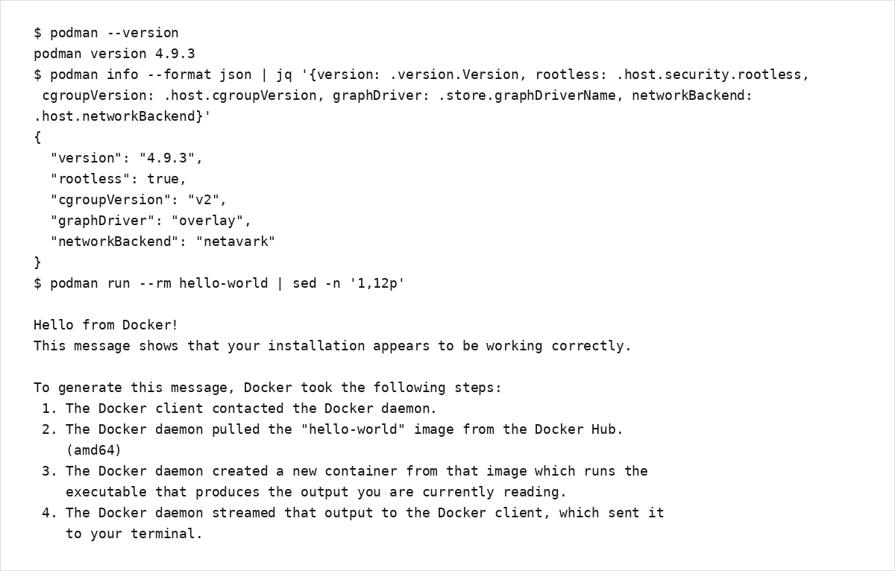

# 第2章：Podmanのインストールと初期設定

## 検証基準と環境

- **プラットフォーム導入手順**: Podman stable文書とv6.0.1（2026-07-08公開）で確認（2026-07-21）
- **Linux実行例**: Ubuntu 24.04 / Podman 4.9.3で確認。ディストリビューションが提供するパッケージのバージョンはOSリリースごとに異なるため、固定値を期待せず`podman --version`で記録します。
- **デスクトップ前提**: macOS / Windowsではホスト側CLIがPodman machine内のLinux Podmanへリモート接続します。Windows向け現行公式ガイドはWindows 11以降を前提とします。
- **rootless前提**: 一般ユーザーで実行する本章のLinux例とmachineのLinuxゲストはrootlessを基準にします。`sudo podman`やmachineをrootfulへ切り替えた場合は、storage、image、containerの表示範囲がrootless側と分かれることを確認します。

## 2.1 自動インストールスクリプト

手動でのインストールはエラーが発生しやすく、環境によって手順が異なります。以下は、内容を確認したうえで `install-podman.sh` として保存し、ローカルで実行する想定の例です。

```bash
#!/bin/bash
# install-podman.sh - Podman自動インストール・設定スクリプト
# 使用方法:
#   chmod +x install-podman.sh
#   ./install-podman.sh

set -e  # エラー時に終了

echo "============================================"
echo "Podman 自動インストールスクリプト v1.0"
echo "============================================"

# OS検出
detect_os() {
    if [ -f /etc/os-release ]; then
        . /etc/os-release
        OS=$ID
        VER=$VERSION_ID
    elif [ -f /etc/redhat-release ]; then
        OS="rhel"
        VER=$(rpm -q --queryformat '%{VERSION}' redhat-release)
    else
        echo "エラー: サポートされていないOSです"
        exit 1
    fi
}

# インストール関数
install_podman() {
    case $OS in
        rhel|centos|fedora)
            echo "Red Hat系ディストリビューションを検出しました"
            sudo dnf install -y podman buildah skopeo
            ;;
        ubuntu|debian)
            echo "Debian系ディストリビューションを検出しました"
            sudo apt update
            sudo apt install -y podman buildah skopeo
            ;;
        *)
            echo "エラー: 未サポートのOS: $OS"
            exit 1
            ;;
    esac
}

# 基本設定
setup_podman() {
    echo "基本設定を適用中..."
    
    # システム設定ディレクトリ作成
    sudo mkdir -p /etc/containers
    
    # cgroup v2 最適化
    if [ ! -f /etc/default/grub.bak ]; then
        sudo cp /etc/default/grub /etc/default/grub.bak
        echo 'systemd.unified_cgroup_hierarchy=1' | sudo tee -a /etc/default/grub
        sudo grub2-mkconfig -o /boot/grub2/grub.cfg 2>/dev/null || true
    fi
    
    # システム移行
    podman system migrate || true
    
    # rootless用設定
    systemctl --user enable --now podman.socket || true
}

# 検証テスト
verify_installation() {
    echo "インストールの検証中..."
    
    # バージョン確認
    podman --version
    
    # hello-worldテスト
    podman run --rm hello-world
    
    if [ $? -eq 0 ]; then
        echo "[OK] Podman が正常にインストールされた"
    else
        echo "[NG] インストールに問題がある"
        exit 1
    fi
}

# メイン処理
detect_os
install_podman
setup_podman
verify_installation

echo ""
echo "インストールが完了しました"
echo "次のコマンドで Podman を使い始められます:"
echo "  podman run -it alpine sh"
```

## 2.2 各OSへのインストール方法（手動）

### RHEL/CentOS/Fedora

```bash
# DNFを使用したインストール
sudo dnf install -y podman

# 関連ツールのインストール
sudo dnf install -y buildah skopeo podman-compose

# バージョン確認と動作テスト
podman --version
# distributionが提供するversionを記録

# 基本的な動作確認
podman run --rm hello-world
# コンテナが正常に実行され、メッセージが表示されることを確認
```

### Ubuntu

```bash
# Ubuntu 22.04/24.04でのインストール（公式リポジトリ）
sudo apt update
sudo apt install -y podman

# バージョン確認と動作テスト
podman --version
podman info
podman run --rm hello-world
```

<a id="figure-podman-verification-screen"></a>



_Ubuntu 24.04 / Podman 4.9.3 における `podman --version` / `podman info` / `podman run --rm hello-world` の出力例。表示内容は環境により異なります。_

### macOS

macOSではhost側の`podman` CLIから、Podman machineが管理するLinux VMへ接続する経路を標準とします。公式installerを使用し、利用するreleaseとchecksumを記録してください。Homebrew版はcommunity-maintainedであり、Podman公式の推奨導入経路ではありません。

```bash
# 公式installerを導入した新しいterminalで確認
podman --version

# Podman machine（標準経路）を作成して起動
podman machine init --now

# host側machineとremote接続先を確認
podman machine list
podman machine inspect
podman system connection list
podman info --format json
```

`podman machine inspect`の`State`が`running`、`Rootful`が`false`であることを確認します。`podman info --format json`ではguest側の情報と`serviceIsRemote`を確認します。machine providerはPodman versionとhost architectureで変わり得るため、固定値を仮定せず`podman machine info`と[podman-machine公式文書](https://docs.podman.io/en/stable/markdown/podman-machine.1.html)で確認します。

### Windows

Windowsでは、PowerShellまたはCMDのnative `podman.exe`からPodman machineへ接続する経路を標準とします。Podman v6.0以降の現行guideはWindows 11以降、hardware virtualization、およびWSL2またはHyper-V providerを前提とします。公式MSIのuser-scope installは管理者権限を必要としませんが、provider自体の有効化条件は別途満たす必要があります。

```powershell
# 公式MSIを導入した新しいPowerShellで確認
podman --version

# default provider（現行WindowsではWSL）でmachineを作成して起動
podman machine init --now

# Windows host側CLI、Podman-managed guest、接続先を確認
podman machine list
podman machine inspect
podman system connection list
podman info --format json
```

Hyper-Vを明示的に選択する場合は、Windows edition、Hyper-V Administrators group、provider準備を確認してから`podman machine init --provider hyperv`を使用します。WSL providerとHyper-V providerのmachineは同時に起動しません。WSLの有効化やHyper-V準備は[Podman for Windows](https://github.com/podman-container-tools/podman/blob/main/docs/tutorials/podman-for-windows.md)を正本とし、本書ではWindows機能の導入手順を重複掲載しません。

#### WSL2 distribution内でLinux版Podmanを直接実行する経路（任意）

既存のUbuntuなどのWSL2 distribution内でLinux版Podmanを直接実行する構成は、Windows host側のPodman machineとは別経路です。この場合、CLIとPodman engineは同じWSL distribution内で動作し、`podman machine init`やmachine用remote connectionは使用しません。

```bash
# 既存WSL2 distributionのLinux shell内で実行
sudo apt update
sudo apt install -y podman

podman --version
podman info --format json
podman system connection list
```

`podman info --format json`の`serviceIsRemote`が`false`であることを確認します。rootless運用では通常のLinuxと同様に`/etc/subuid`、`/etc/subgid`、user namespace、storage driverを確認します。Windows側のPodman machineとdirect WSL2のimage、container、volume、connection設定は共有されない前提で管理してください。

#### 経路の選択と切り分け

| 経路 | CLIを実行する場所 | Linux実行環境 | CLIの接続先 | rootlessと状態 |
|---|---|---|---|---|
| macOS標準 | macOS terminalの`podman` | Podman-managed Linux VM | machineが登録するremote connection | guestはrootless既定。machine単位で状態を管理 |
| Windows標準 | PowerShell / CMDの`podman.exe` | Podman-managed WSL distributionまたはHyper-V VM | machineが登録するremote connection | guestはrootless既定。rootfulとはstorageを分離 |
| WSL2 direct（任意） | 既存WSL2 distributionのLinux shell | そのWSL2 distribution | local Podman（`serviceIsRemote: false`） | Linux側userのrootless設定とstorageを使用 |

切り分け時は、まずCLIを実行しているshellを確認します。host側の標準経路では`podman machine list`、`podman machine inspect`、`podman system connection list`を確認します。WSL2 direct経路では`command -v podman`と`podman info --format json`を確認し、machine側のcontainerが見えないことを障害と誤認しないでください。

- [Podman installation](https://podman.io/docs/installation)
- [podman-machine](https://docs.podman.io/en/stable/markdown/podman-machine.1.html)
- [podman-machine-inspect](https://docs.podman.io/en/stable/markdown/podman-machine-inspect.1.html)
- [Podman for Windows](https://github.com/podman-container-tools/podman/blob/main/docs/tutorials/podman-for-windows.md)

## 2.3 初期設定

### 設定ファイルの場所

```bash
# システム全体の設定
/etc/containers/

# ユーザー別の設定
~/.config/containers/

# 主要な設定ファイル
registries.conf  # レジストリ設定
storage.conf     # ストレージ設定
policy.json      # セキュリティポリシー
```

### レジストリの設定

```bash
# /etc/containers/registries.conf
[registries.search]
registries = ['docker.io', 'quay.io', 'registry.fedoraproject.org']

[registries.insecure]
registries = []

[registries.block]
registries = []

# 認証情報の設定
podman login docker.io
podman login quay.io
```

### ストレージの設定

```bash
# ~/.config/containers/storage.conf
[storage]
driver = "overlay"
runroot = "/run/user/1000/containers"
graphroot = "/home/user/.local/share/containers/storage"

[storage.options]
size = "10G"
override_kernel_check = "true"
```

## 2.4 Rootlessモードの設定

### 前提条件の確認

> **注意（OS設定の変更について）**
> - `/etc/subuid`・`/etc/subgid` の設定変更は、ユーザー名前空間のマッピングに影響します。誤設定すると rootless 実行ができなくなったり、既存のコンテナ環境に影響が出る可能性があります。
> - まずは検証環境で試し、必要に応じて設定ファイルのバックアップを取得したうえで変更してください。

```bash
# ユーザー名前空間の確認
sysctl kernel.unprivileged_userns_clone

# subuid/subgidの確認
grep $USER /etc/subuid
grep $USER /etc/subgid

# 必要に応じて追加
sudo usermod --add-subuids 100000-165535 --add-subgids 100000-165535 $USER
```

### Rootless環境の初期化

```bash
# systemdユーザーセッションの有効化
systemctl --user enable --now podman.socket

# 環境変数の設定
echo 'export DOCKER_HOST=unix://$XDG_RUNTIME_DIR/podman/podman.sock' >> ~/.bashrc

# cgroups v2の確認
podman info | grep -i cgroup
```

## 2.5 Docker互換性の設定

### Docker CLIの置き換え

```bash
# エイリアスの設定
echo 'alias docker=podman' >> ~/.bashrc
source ~/.bashrc

# Docker Compose（docker compose）の互換性（Composeファイル）
pip3 install podman-compose

# docker-compose.yml があるディレクトリで実行するか、-f で Compose ファイルを明示的に指定する
cd /path/to/project
podman-compose -f docker-compose.yml up -d
```

### Docker APIソケットの有効化

```bash
# Rootlessモード
systemctl --user enable --now podman.socket

# Rootfulモード
sudo systemctl enable --now podman.socket

# ソケットの確認
curl --unix-socket /run/user/$(id -u)/podman/podman.sock http://localhost/v1.41/info
```

## 2.6 基本動作の確認

### Hello Worldコンテナの実行

```bash
# 基本的な実行
podman run hello-world

# Alpineコンテナでコマンド実行
podman run --rm alpine echo "Hello from Podman"

# インタラクティブモード
podman run -it --rm alpine /bin/sh
```

### イメージとコンテナの管理

```bash
# イメージの一覧
podman images

# コンテナの一覧
podman ps -a

# システム情報の確認
podman info

# ディスク使用量の確認
podman system df
```

## 2.7 トラブルシューティング

インストールと初期設定で詰まった場合は本節を参照し、稼働後の横断的な一次切り分けは [付録B：トラブルシューティングガイド](../../appendices/appendix-b/) を起点にしてください。

### よくある問題と解決方法

**1. "permission denied"エラー**
```bash
# SELinuxの確認
getenforce

# 一時的に無効化（テスト用）
sudo setenforce 0

# コンテキストの修正
sudo restorecon -R ~/.local/share/containers
```

**2. ネットワーク接続の問題**
```bash
# DNS設定の確認
podman run --rm alpine nslookup google.com

# ネットワークの再作成
podman network rm podman
podman network create podman
```

**3. ストレージ容量不足**
```bash
# 現状確認（何が容量を使っているか）
podman system df
podman ps -a
podman images
podman volume ls

# 影響が小さい順に段階的にクリーンアップする
# 停止中のコンテナの削除（必要ならログ/設定を退避してから）
podman container prune

# dangling なイメージの削除（影響が比較的小さい）
podman image prune

# 影響が大きい操作（未使用イメージも削除されるため注意）
podman image prune --all

# 影響が大きい操作（未使用のコンテナ/ネットワーク/イメージ等をまとめて削除）
podman system prune
podman system prune --all
```

## インストール後の検証チェックリスト

インストール完了後、以下の項目を確認してください。

```bash
#!/bin/bash
# インストール検証スクリプト

echo "[INFO] Podman バージョン確認"
podman --version

echo "[INFO] システム情報"
podman info --format json | jq '.version, .kernel, .os'

echo "[INFO] cgroup バージョン"
podman info | grep -i cgroup

echo "[INFO] rootless 動作確認"
if podman info | grep -q "rootless: true"; then
    echo "  Rootless モードで動作中"
else
    echo "  Root モードで動作中"
fi

echo "[INFO] ネットワーク接続"
podman run --rm alpine ping -c 1 google.com

echo "[INFO] ストレージ状態"
podman system df

echo "[INFO] Docker 互換ソケット"
if systemctl --user is-active podman.socket >/dev/null 2>&1; then
    echo "  Podmanソケットが有効"
fi
```

## まとめ

本章では、Podman 5.0.xのインストールから初期設定、基本的な動作確認までを解説しました。特に以下のポイントが重要です。

- **自動化スクリプトの活用**: 環境構築の再現性を確保
- **Rootlessモードの設定**: セキュリティを強化
- **Docker互換性の確保**: 既存資産の活用
- **検証テストの実施**: 正常動作の確認

次章では、Podmanを安定してRootless運用するためのホスト設定と実行基盤を解説します。基本的なコンテナ操作は第4章で扱います。

## 次に読む

- [第3章：ホスト設定とRootless環境の最適化](../chapter03/)
- [目次に戻る](../../)
